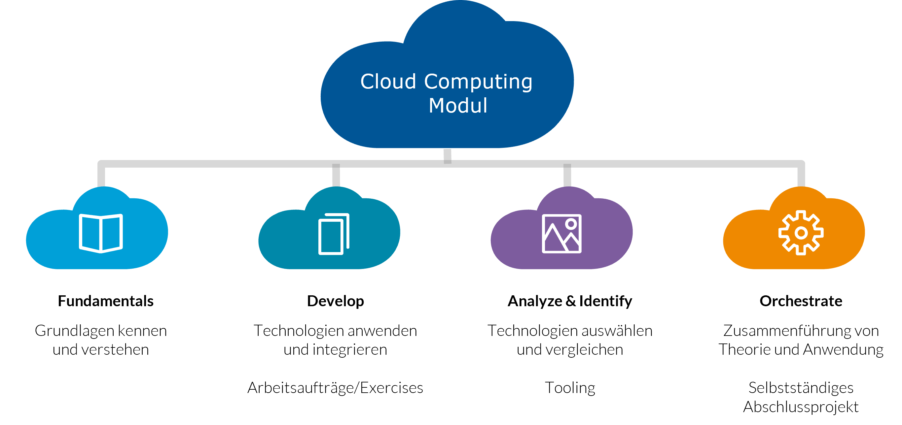

# Kursmodalitäten Cloud Computing

## Aufbau des Moduls

  

  
<b>Fundamentals - Theorie (in den VO)</b>
 
  
  <ul>
    <li>Grundlagenwissen und Hintergründe</li>
    <li>Aktive Diskussion</li>
    <li>Präsentationen und Besprechung von Exercises</li>
  </ul>
  

  

    
<b>Exercises (betreutes Lernen, Self-Learning)</b>

    <ul>
      <li>Geleitete Anwendung durch Tutorials und Step-by-Step Anleitungen</li>
      <li>Hands-On Arbeitsaufträge</li>
    </ul>
  

  

  
<b>Abschluss</b>

    <ul>
      <li>Eigenverantwortliche Bearbeitung eines größeren Projekts, das abschließend präsentiert wird.</li>
      <li>Schriftliche Prüfung in der letzten Einheit.</li>
    </ul>
  

## Lernziele

 
## Grading

  

  <ul>
    <li>Arbeitsaufträge (Exercises) - sind freiwillig, dienen aber als Basis für das Abschlussprojekt!</li>
    <li>Cloud Migration Case Study – 10%</li>
    <li>Abschlussprojekt (in Kleingruppen) – 40%</li>
    <li>Schriftliche Prüfung – 50%</li>
    <li><b>Für einen positiven Abschluss der LV müssen das Abschlussprojekt, die Prüfung und der Kurs gesamt mit >= 60% bewertet werden.</b></li>
  </ul>
  

## Termine - 2024

  

  <ul>
    <li>05.8.2024: Präsentation der Cloud Migration Case Studies</li>
    <li>3.9.2024: Abgabe Abschlussprojekt und Projektpräsentation</li>
    <li>13.9.2024: schriftliche Prüfung</li>
  </ul>
  

## Vortragender

  

    

    

      
    

      

        <h2>Leon Freudenthaler</h2>
        
Hauptverantwortlicher Vortragender

        
leon.freudenthaler@fh-campuswien.ac.at

        
<a href="mailto:leon.freudenthaler@fh-campuswien.ac.at">Contact</a>

      

    

  

<!--
  

    

    

      
    

      

        <h2>Bernhard Taufner</h2>
        
Vortragender

        
bernhard.taufner@fh-campuswien.ac.at

        
<a href="mailto:bernhard.taufner@fh-campuswien.ac.at">Contact</a>

      

    

  

  -->

