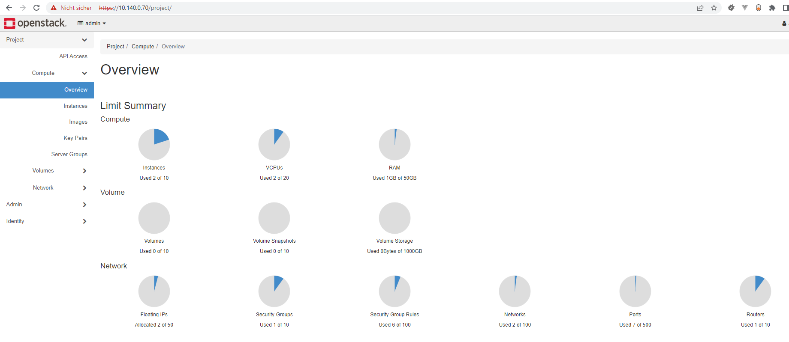
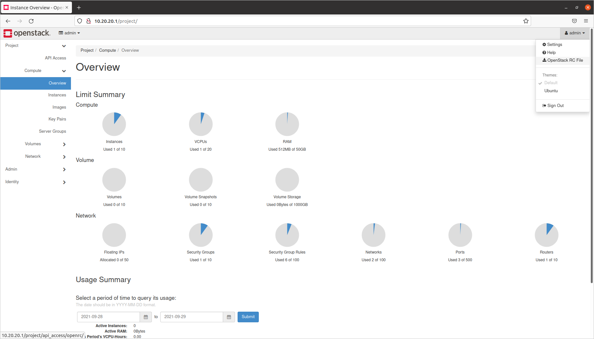

# OpenStack Components
> Note: Dieser Arbeitsauftrag basiert auf [OpenStack Tutorials](https://ubuntu.com/openstack/tutorials)


OpenStack besteht aus den folgenden Grundkomponenten:

* **OpenStack Services** stellen API-Endpunkte bereit und bieten grundlegende Cloud-Funktionen wie die Pflege des Image-Katalogs, die Bereitstellung und Verwaltung von Instanzen usw.

* **OpenStack Dashboard** stellt ein webbasiertes User Interface zur Verwendung von OpenStack Services bereit.

* **OpenStack Client** stellt ein Command-line User Interface zur Verwendung von OpenStack Services bereit.

* **SQL Databases** speichert verschiedenste Datensätze, die von OpenStack Services benötigt werden.

* **Message queues** erleichtern die Inter-Prozess-Kommunikation zwischen den verschiedenen Komponenten der OpenStack Services.

Zusätzliche Komponenten, wie **NoSQL-Datenbanken** oder **memcached**, können in fortgeschritteneren Szenarien erforderlich sein.

## MicroStack snap CLI

MicroStack snap bietet ein Command-Line Interface für OpenStack Services. 
Das CLI heißt `microstack.openstack` und ist ein Wrapper um das `openstack` CLI. Das bedeutet, dass MicroStack snap CLI verwendet werden kann, ohne den OpenStack-Client zu installieren. 
Um einen gewünschten Befehl auszuführen, muss einem OpenStack-Client Befehl jeweils ein ``microstack`` voranstehen. Um zum Beispiel alle gestarteten Instanzen aufzulisten:

```bash
microstack.openstack server list --all-projects
```
Dieser Command sollte nun die Instanz anzeigen, die bei der OpenStack Installation erstellt wurdel:

```bash
+--------------------------------------+------------+---------+---------------------------------+--------+---------+
| ID                                   | Name       | Status  | Networks                        | Image  | Flavor  |
+--------------------------------------+------------+---------+---------------------------------+--------+---------+
| 0c2d82b3-5a6d-4d3b-bd1f-583dfcce5898 | myInstance | SHUTOFF | test=192.168.222.81, 10.20.20.5 | cirros | m1.tiny |
+--------------------------------------+------------+---------+---------------------------------+--------+---------+
```

## OpenStack Dashboard - Horizon
Das default Dashboard in OpenStack heißt wird **Horizon** genannt und stellt eine webbasierte Benutzeroberfläche für OpenStack-Services bietet. Es ermöglicht Benutzer:innen die Verwaltung der Cloud.

::: danger TODO
// TODO port forward das Dashboard oder Wireguard
// default: https://10.20.20.1
// get ip and port: openstack --insecure catalog list
:::

Öffnet das Dashboard in einem Browser eurer Wahl.


*OpenStack Dashboard Login*

Um die notwendigen Credentials für den `Admin` User des Dashboard zu bekommen, muss folgender Command ausgeführt werden:

```
sudo snap get microstack config.credentials.keystone-password
```

Zur Anmeldung nun das ausgegebene Passwort und den User Name `admin` nutzen. War die Anmeldung erfolgreich, sollte das Dashboard angezeigt werden:



*OpenStack Dashboard*

Dies ist die Landing Page des OpenStack-Dashboards. Sie zeigt alle virtuellen Ressourcen an, die innerhalb des ``Admin`` Projekts erstellt wurden. 
Wie man sehen kann läuft in unserer OpenStack-Cloud bereits eine Instanz, die 1 vCPU und 512 MB RAM verbraucht. Das ist jene Instanz die wir zuvor erstellt haben.

Damit wir in einem nächsten Schritt den OpenStack Client einrichten können, muss im Dashboard unter dem Dropdown Menü `admin`(rechts oben) das **OpenStack RC File** heruntergeladen werden.

*Download RC File*

> Note: Das File muss ggf. akzeptiert werden. Es kann auch sein, dass ihr nach einem Passwort gefragt werdet, hinterlegt hier das Passwort eures Dashboards.

## OpenStack Client einrichten
Obwohl MicroStack mit einem integrierten OpenStack-Client geliefert wird, ist dieser nur nützlich, wenn MicroStack mit nur einem Tenant verwendet wird.
In einer Multi-Tenant-Umgebung muss der OpenStack-Client von jedem Tenant eingerichtet werden, um Remote-Verbindungen zur OpenStack-Cloud zu ermöglichen.

Damit wir im Zuge der Arbeitsaufträge eine Multi-Tenant-Umgebung schaffen können, wird im folgenden Schritt der OpenStack Client installiert:
````bash
sudo snap install openstackclients
````

Um mit der OpenStack-Cloud kommunizieren zu können, müssen auf dem OpenStack-Client mehrere Umgebungsvariablen gesetzt sein. 
Diese sind in der RC-Datei definiert, die ihr zuvor heruntergeladen habt.
Dafür muss die Datei nun wie folgt am Server erstellt und befüllt werden:
````bash
sudo touch admin-openrc.sh
sudo nano admin-openrc.sh
````

Kopiert nun die Inhalte der Datei in euer File am Server und speichert die Änderungen. Anschließend muss nur noch das ``admin-openrc.sh`` File als Source hinterlegt werden. 
Authentifiziert euch mit dem Passwort von zuvor.
````bash 
source admin-openrc.sh
````

Nun sollte der OpenStack Client mit der OpenStack Cloud kommunizieren können. Versucht beispielsweise alle eure Instanzen auflisten zu lassen:

````bash 
openstack --insecure server list
````

> Note: Da MicroStack standardmäßig selbstsignierte Zertifikate nutzt, sollte um Fehler zu vermeiden, die ``--insecure`` Flag gesetzt werden. Diese deaktiviert die Validierung der Zertifikate.


## Admin Passwort ändern
In der oberen rechten Ecke befindet sich ein Dropdown-Menü, das den Namen des aktuellen Benutzers (in diesem Fall ``admin``) enthält. 
Zum Ändern des Passworts den Punkt ``Settings`` und danach den Punkt ``Change Password`` auswählen.

> Note: solltet ihr eine **Bad Gateway** Fehlermeldung im Browser bekommen, ändert bitte zuvor die Sprache in den ``User Settings`` auf `English(en)`

Nach dem Passwort-Reset muss auch der Openstack Client mit dem neuen Passwort authentifiziert werden:

````bash
source admin-openrc.sh
````

Testet beispielsweise mit dem ``microstack.openstack server list`` Command, ob das Passwort richtig hinterlegt wurde.

