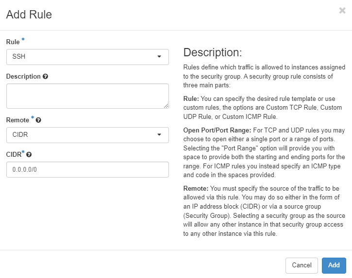
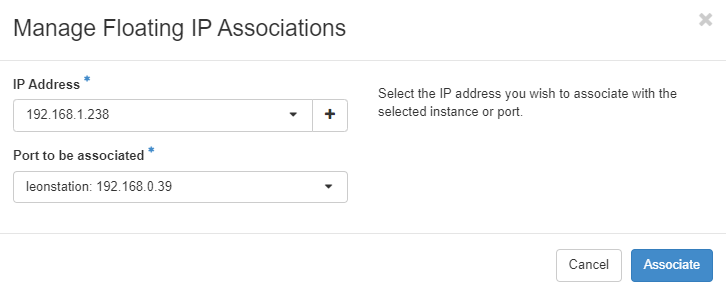

# {{ $frontmatter.title }}
> Note: Grundlage des Arbeitsauftrags ist die [OpenStack Documentation](https://docs.openstack.org/2023.1/)

[OpenStack](https://www.openstack.org/) ist die beliebteste Open-Source-Cloud-Plattform, die verteilte Rechen-, Netzwerk- und Speicherressourcen im Rechenzentrum zusammenfasst und die bedarfsgerechte Bereitstellung virtueller Maschinen über ein Self-Service-Portal ermöglicht. 
OpenStack ist die beliebteste Open-Source-Cloud-Plattform, die große Pools von Rechen-, Speicher- und Netzwerkressourcen in einem Rechenzentrum steuert, welche über APIs mit gemeinsamen Authentifizierungsmechanismen verwaltet und bereitgestellt werden.
Zur Bereitstellung und Steuerung der Services kann auch über ein Self-Service-Portal (Web Dashboard) genutzt werden.
Über die Standardfunktionalität von Infrastructure-as-a-Service hinaus bieten zusätzliche Komponenten unter anderem Orchestrierung, Fehlermanagement und Servicemanagement, um eine hohe Verfügbarkeit der Benutzeranwendungen zu gewährleisten.
OpenStack betreibt tausende von öffentlichen und privaten Clouds auf der ganzen Welt.


*OpenStack Überblick.* [Source](https://www.openstack.org/)


OpenStack besteht aus mehreren Kernkomponenten und [Services](https://www.openstack.org/software/project-navigator/openstack-components/#openstack-services), die je nach Bedürfnis individuell zusammengestellt und verwendet werden können.
Das untenstehende Diagramm zeigt die verfügbaren Services von OpenStack und wie diese zusammenspielen.

**OpenStack Grundkomponenten:**

* **OpenStack Services** stellen API-Endpunkte bereit und bieten grundlegende Cloud-Funktionen wie die Pflege des Image-Katalogs, die Bereitstellung und Verwaltung von Instanzen usw.

* **OpenStack Dashboard** stellt ein webbasiertes User Interface zur Verwendung von OpenStack Services bereit.

* **OpenStack Client** stellt ein Command-line User Interface zur Verwendung von OpenStack Services bereit.

* **SQL Databases** speichert verschiedenste Datensätze, die von OpenStack Services benötigt werden.

* **Message queues** erleichtern die Inter-Prozess-Kommunikation zwischen den verschiedenen Komponenten der OpenStack Services.

Zusätzliche Komponenten, wie **NoSQL-Datenbanken** oder **memcached**, können in fortgeschritteneren Szenarien erforderlich sein.


*OpenStack Services.* [Source](https://www.openstack.org/software/)


### Was ist Devstack?
Unsere OpenStack Distribution basiert auf [DevStack](https://opendev.org/openstack/devstack). DevStack ist eine Reihe von individuell annpassbaren Scripts, die verwendet werden, um schnell eine komplette OpenStack-Umgebung zu erstellen.
Zur Installation von Devstack wird die neueste Versionen mithilfe von [Git](https://git-scm.com/) verwendet. 
Es wird interaktiv als Entwicklungsumgebung und als Grundlage für einen Großteil der Funktionstests des OpenStack-Projekts verwendet.

### Ziele von Devstack
* Schnelle und einfache Erstellung und Aufsetzen einer Development Umgebung für Openstack in Ubuntu oder Fedora
* Beschreibung funktionierender Konfigurationen von OpenStack (welche Code-Zweige arbeiten zusammen? wie sehen die Konfigurationsdateien für diese Zweige aus?) -> Opensource Development
* Entwickler:innen den Einstieg in OpenStack zu erleichtern, damit sie produktiv mitarbeiten können, ohne jeden Teil des Systems auf einmal verstehen zu müssen
* Einfaches Erstellen von Prototypen für projektübergreifende Funktionen

::: warning WARNUNG
Devstack installiert und deinstalliert Applikationen in seiner Entwicklungsumgebung, es sollte deshalb immer nur in einem gekapselten System ausgeführt werden. Am sinnvollsten ist es Devstack in einer virtuellen Maschine isoliert zu installieren.
:::

## Tutorial Start - Erstellen und Verwalten von IaaS Ressourcen in OpenStack

## Login
Rufe das [Horizon Dashboard](http://csdc-server3.fh-campuswien.ac.at/dashboard) von OpenStack in einem Browser deiner Wahl auf. Nutze den dir zugewiesenen Usernamen und Passwort zum Einloggen. 
::: warning Passwort ändern
Ändere gleich zu Beginn dein Passwort!

Im rechten Eck des Dashboard auf den Usernamen -> Einstellungen -> Passwort ändern
:::


*OpenStack Dashboard.* 

Deine OpenStack-Umgebung ist durch die Verwendung von Projekten (siehe Topmenü) unterteilt. Jedes Projekt kann zugehörige Benutzer, mit unterschiedlichen Berechtigungsebenen haben, die durch Benutzerrollen definiert sind. In diesem Kurs wurde Dir bereits ein eigenes Projekt erstellt und deinem Benutzer zugeteilt.

Nachdem Du Dich mit deinem Benutzer in Dein Dashboard eingeloggt hast, siehst Du die Registerkarten "Projekt" und "Identität" (links).
Elemente unter der Registerkarte "Projekt" ermöglichen es Dir, Ressourcen in einem ausgewählten Projekt anzuzeigen und zu verwalten, wie Instanzen und Abbilder (Images).

Innerhalb der Registerkarte "Projekt" hast Du die Möglichkeit, zusätzliche Einstellungsregisterkarten anzuzeigen und zu konfigurieren, die Dir helfen, Deine Ressourcen zu verwalten.
Diese zusätzlichen Registerkarten umfassen "Compute", Datenträger (Volumes) und Netzwerk. In einer realen Installation von OpenStack können mehr als diese 3 Registerkarten vorhanden sein, z.B. "Container Infra", "Orchestration" und "Object Store".

Die **Compute**-Registerkarte enthält die folgenden Ansichten und Optionen:

* **Übersicht** ermöglicht es Dir, Berichte für das Projekt anzuzeigen.
* **Instanzen** ermöglichen es Dir, eine Instanz anzuzeigen und zu starten. Du kannst auch eine Instanz aus einem Schnappschuss (Kopie) erstellen und Instanzen anhalten, pausieren oder neu starten.
* **Abbilder** ermöglichen es Dir, Abbilder und Instanzschnappschüsse anzuzeigen, sowie Abbilder, die öffentlich verfügbar sind (z.B. Ubuntu Image, CentOS, Rocky Linux,...). Du kannst Instanzen aus Abbildern und Schnappschüssen starten und Abbilder erstellen, bearbeiten und löschen.
* **Schlüsselpaare** ermöglichen es Dir, Schlüsselpaare anzuzeigen, zu erstellen, zu bearbeiten, zu importieren und zu löschen. Zum Beispiel benötigt, um "SSH"-Verbindungen zu Deinen Instanzen zu ermöglichen.
* **Servergruppen** erlauben es, einer Servergruppe zugewiesen zu werden, um die Instanz zu starten.

Die **Datenträger**-Registerkarte enthält die folgenden Ansichten und Optionen:

* **Datenträger (Volumes)** ermöglichen es Dir, Datenträger anzuzeigen, zu erstellen, zu bearbeiten und zu löschen. Ein Volume bezieht sich auf ein Blockspeichergerät, das an eine Instanz angeschlossen werden kann. Es bietet persistente Speicherung für Instanzen und ermöglicht das Speichern und Abrufen von Daten unabhängig vom Zustand Deiner Instanz (z. B. Ausführung, Herunterfahren).
* **Schattenkopien (Schnappschüsse)** ermöglichen es Dir, Volumeschnappschüsse anzuzeigen, zu erstellen, zu bearbeiten und zu löschen.
* **Gruppen** ermöglichen es Dir, Konsistenzgruppen anzuzeigen, zu erstellen, zu bearbeiten und zu löschen.
* **Gruppenschnappschüsse** ermöglichen es Dir, Konsistenzgruppenschnappschüsse anzuzeigen, zu erstellen, zu bearbeiten und zu löschen.

Die **Netzwerk**-Registerkarte enthält die folgenden Ansichten und Optionen:

* **Netzwerktopologie** ermöglicht es Dir, die Netzwerktopologie anzuzeigen.
* **Netzwerke** ermöglichen es Dir, öffentliche und private Netzwerke zu erstellen und zu verwalten.
* **Router** ermöglichen es Dir, Router zu erstellen und zu verwalten, die mit Deinen Netzwerken verbunden sind.
* **Sicherheitsgruppen** ermöglichen es Dir, Sicherheitsgruppen und Sicherheitsgruppenregeln anzuzeigen, zu erstellen, zu bearbeiten und zu löschen.
* **Floating IPs** ermöglichen es Dir, einer Projekt eine IP-Adresse zuzuweisen oder sie freizugeben.

Elemente unter der Registerkarte "Identität" ermöglichen es Dir, Projekte, an denen Du beteiligt bist, anzuzeigen und zu verwalten, sowie Benutzer zuzuweisen und zu entfernen.

Die **Identität**-Registerkarte enthält die folgenden Ansichten und Optionen:

* **Projekte** ermöglichen es Dir, Projekte anzuzeigen, zu erstellen, Benutzer zuzuweisen, Benutzer aus Projekten zu entfernen und Projekte zu löschen.
* **Benutzer** ermöglichen es Dir, Benutzer anzuzeigen, zu erstellen, zu aktivieren, zu deaktivieren und zu löschen.
* **Applikations-Zugangsdaten** ermöglichen es Dir, Anmeldeinformationen für den Zugriff auf ein ausgewähltes Projekt zu erstellen und zu verwalten.


## Ziele der Übung
Ziel dieser Übung ist es, einige Services des IaaS Layer kennenzulernen und in einer privaten Cloud einzurichten. 
Deshalb werden wir eine Instanz in der OpenStack Cloud erstellen. Diese Instanz (oder auch VM genannt) wird in einem privaten Netzwerk eingerichtet. Ein Router wird diese Instanz nach Außen freigeben, damit wir von außerhalb des Netzwerks mit der Instanz kommunizieren (z.B. SSH) können. Dabei werden wir auch eine Sicherheitsgruppe erstellen und zuweisen.


## Verwalten von Abbilern (Images) und virtuellen Maschinen in OpenStack

Bevor wir das private Netzwerk und die virtuelle Maschine erstellen, werfen wir einen Blick auf den ``Abbilder``-Tab unter `Compute`. Die sogenannten Abbilder oder Images enthalten ein startfähiges Betriebssystem, das OpenStack verwendet, um eine Instanz zu erstellen (z.B. Linux Distributionen wie Ubuntu, Rocky Linux und co).

Die DevStack-Installation wird mit einem vorinstallierten Image namens ``cirros-0.6.1-x86_64-disk`` geliefert, das wir in dieser Übung verwenden werden.


*OpenStack Images*

Es ist möglich, andere Image-Dateien hochzuladen, um verschiedene Betriebssysteme in Euren virtuellen Maschinen zu verwenden.
Zum Beispiel könntest du die [CentOS ISO](http://ftp.tugraz.at/mirror/centos/8-stream/isos/x86_64/) herunterladen und sie über den Abschnitt ``Abbild erstellen`` zu deinen Images hinzufügen. In dieser Übung verwenden wir das vorinstallierte CirrOS-Image.

## Instanzen in OpenStack
Mit OpenStack spielen Instanzen oder virtuelle Maschinen eine wichtige Rolle in der Arbeitslast einer Cloud.
OpenStack bietet eine Möglichkeit, Instanzen mit seinem Compute-Dienst, genannt **Nova**, zu erstellen und zu verwalten.

Nova ist das OpenStack-Projekt, das eine Möglichkeit zum Bereitstellen von Berechnungsinstanzen bietet und die Erstellung von virtuellen Maschinen, Bare-Metal-Servern unterstützt und eine eingeschränkte Unterstützung für Systemcontainer bietet.
Nova läuft als eine Reihe von Daemons auf vorhandenen Linux-Servern, um diesen Dienst bereitzustellen.

In den folgenden Schritten werden wir eine Instanz erstellen, einschließlich der Einrichtung eines privaten Netzwerks und Routers, der Erstellung einer Sicherheitsgruppe und dem Hinzufügen eines SSH-Schlüsselpaars, damit wir mit dieser Instanz kommunizieren können.

## Einrichten eines privaten Netzwerks

Bevor wir eine virtuelle Maschine erstellen, richten wir ein privates Netzwerk und einen Router ein, in dem die VM ausgeführt wird.
Um ein privates Netzwerk zu erstellen, navigiere zu **Projekt -> Netzwerk -> Netzwerke**. Klicke dann auf ``Netzwerk erstellen``.


*Privates Netzwerk erstellen*

Wir werden ein Netzwerk mit dem Namen ``private`` und ein Subnetz namens `private-subnet` erstellen, um unser IP-Netzwerk logisch zu unterteilen.


*Schritt 1: Privates Netzwerk erstellen*

Gib deinem Netzwerk im ersten Schritt den Namen ``private`` und lasse alle anderen Einstellungen standardmäßig. Drücke `Weiter`, um zum Subnetz-Menü zu gelangen.


*Schritt 2: Privates Netzwerk erstellen*

Wähle im Subnetz-Tab ``private-subnet`` als Namen aus und gib ihm einen Netzwerkbereich, zum Beispiel `192.168.0.1/24`. Dies ermöglicht einen Hostbereich von 192.168.0.1 bis 192.168.0.254 und erlaubt maximal 254 Hosts im Subnetz (ohne Netzwerk- und Broadcast-Adressen).

**Erklärung:**

* Private IP-Adresse: 192.168.0.1 gehört zum Bereich der privaten IP-Adressen, die für interne Netzwerke verwendet werden und nicht im öffentlichen Internet routbar sind. Dies ist ideal für Heimnetzwerke und lokale Netzwerke in Unternehmen.

* Netzmaske /24: Die Subnetzmaske /24 (auch als 255.255.255.0 dargestellt) bedeutet, dass die ersten 24 Bits der IP-Adresse das Netzwerk kennzeichnen, während die letzten 8 Bits für Hosts im Netzwerk verwendet werden. Dies ermöglicht bis zu 256 Adressen (0-255) in diesem Subnetz, von denen 254 für Geräte (Hosts) genutzt werden können (0 ist das Netzwerk selbst und 255 ist die Broadcast-Adresse).


*Schritt 3: Privates Netzwerk erstellen*

Lasse alle Subnetzdetails standardmäßig. Wir lassen ``DHCP`` aktiviert, damit das Netzwerk automatisch IP-Adressen, Subnetzmasken, Standardgateways und andere Netzwerkkonfigurationen zuweist.

## Erstellen eines Routers

Als nächstes erstellen wir einen Router, um die Verbindung zwischen dem privaten und dem öffentlichen Netzwerk herzustellen. Das öffentliche Netzwerk ist standardmäßig in DevStack konfiguriert und heißt ``public``.

Um einen Router zu erstellen, navigiere zu **Projekt -> Netzwerk -> Router**. Klicke auf ``Router erstellen``.


*Router erstellen*

Benenne deinen Router einfach ``router`` und wähle `public` als dein externes Netzwerk aus.

Jetzt müssen wir den Router unserem Netzwerk hinzufügen. Dafür werden wir eine Schnittstelle (Interface) definieren und dem Router hinzufügen. Klicke auf ``Router`` in deiner Routerliste, um zum Bildschirm mit den Routerdetails zu gelangen.

Wähle in den Routerdetails ``Schnittstellen`` und `Schnittstelle hinzufügen`:

*Schnittstelle zum Router hinzufügen*

Wähle im neuen Interface das ``private-subnet`` als Subnetz aus. Wenn du keine IP-Adresse festlegst, wird automatisch eine ausgewählt.
Drücke ``Übertragen``, um das private Netzwerk an diesen Router anzuhängen. Die Schnittstelle wird dann angehängt und ist nun aufgelistet.


*Schnittstellen des Routers*

Du kannst die Netzwerktopologie für deine Cloud visuell anzeigen, indem du zu **Projekt -> Netzwerk -> Netzwerktopologie** navigierst:


*Netzwerktopologie*

Das ``public`` Netzwerk ist jetzt über dein ``private`` Netzwerk mit dem Router namens ``router`` verbunden. Wir können das ``shared`` Netzwerk vorerst ignorieren, da es keine Auswirkungen auf unsere Topologie hat.

## Erstellen einer Sicherheitsgruppe

Sicherheitsgruppen ermöglichen die Kontrolle des Netzwerkverkehrs zu und von virtuellen Maschinen.
Beispielsweise kann der Port 22 für SSH für eine einzelne IP oder einen IP-Bereich geöffnet werden.

Um Sicherheitsgruppen anzuzeigen und zu verwalten, navigiere zu **Projekt -> Netzwerk -> Sicherheitsgruppen**.

Du solltest eine einzelne Sicherheitsgruppe namens ``default`` sehen. Diese Sicherheitsgruppe beschränkt den eingehenden (``Eintritt`` oder `Ingress`) Netzwerkverkehr und erlaubt den ausgehenden (``Austritt`` oder `Egress`) Netzwerkverkehr.
Beim Erstellen einer Instanz wird diese Sicherheitsgruppe standardmäßig angewendet.

Um eine Sicherheitsgruppe für SSH zu erstellen, klicke oben rechts auf ``Sicherheitsgruppe erstellen``.
Benenne die Gruppe **SSH** und klicke dann auf ``Sicherheitsgruppe erstellen``.

*Sicherheitsgruppe erstellen*

Nachdem du die SSH-Sicherheitsgruppe erstellt hast, müssen wir **Regeln** hinzufügen, die den Netzwerk-Verkehr erlauben.
Zuerst wenden wir eine Regel an, um unserer zukünftigen Instanz das Pingen zu erlauben.
Danach werden wir den SSH-Verkehr zur Instanz mit einer weiteren Regel freigeben.

Um eine Regel hinzuzufügen, klicke auf ``Regel hinzufügen`` oben rechts.

Erstens wähle ``Alle ICMP`` aus und klicke auf `Hinzufügen`, um die Regel zu erstellen:


*Regel hinzufügen 1*

"Alle ICMP" bezieht sich darauf, alle Arten von ICMP (Internet Control Message Protocol)-Verkehr zu erlauben. 
Es umfasst Nachrichten wie Ping-Anfragen (ICMP Echo Request) und Ping-Antworten (ICMP Echo Reply) sowie andere Arten von Nachrichten für Netzwerkdiagnosen, Fehlerberichterstattung und Fehlerbehebung.

::: warning Warnung
Es ist wichtig, die Sicherheitsimplikationen der Zulassung des gesamten ICMP-Verkehrs zu berücksichtigen, da bestimmte Arten von ICMP-Nachrichten für Netzwerkangriffe oder -aufklärung missbraucht werden können.
:::

Zweitens erstelle eine weitere Regel und wähle ``SSH`` aus. Unter `CIDR` könntest du eine spezifische IP-Adresse angeben, die über SSH zugelassen werden soll. Für unsere Zwecke reicht der Default `0.0.0.0/0`, da unsere Instanzen nur privat im Netzwerk verfügbar sein werden.

::: danger Achtung
Erlaube niemals den SSH-Zugriff von allen IP-Adressen in einer öffentlichen Cloud-Umgebung!
:::


*Regel hinzufügen 2*


## Erstelle eine Instanz

Um eine Instanz zu erstellen, navigiere zu **Projekt -> Compute -> Instanzen**. Klicke dann auf die Schaltfläche ``Instanz starten``.


*Instanz starten*

Gib im Detailbereich einen Namen für die Instanz an, z.B.: ``mystation``. Lass `nova` als Standardverfügbarkeitszone.

**Count** steuert die Anzahl der erstellten Instanzen. Wir werden nur 1 Instanz erstellen.


*Instanzdetails*

Wähle im Tab Quelle das ``cirros``-Image aus (Tab der **Pfeil nach oben**) und lass die Standardeinstellungen:

* Wähle Bootquelle: Image
* Neues Volume erstellen: ja
* Volume beim Löschen der Instanz löschen: Nein
* Volume-Größe: 1GB


*Instanz Quelle*

Als nächstes wechsle zum Flavor-Tab. 
Flavors sind eine Möglichkeit, die VCPUs, den RAM und den Festplattenspeicher, die von einer Instanz verwendet werden, zu definieren. 
Vorbereitete Flavors stehen dir zur Verfügung. Wähle für diesen Schritt einen geeigneten Flavor aus den Optionen unter der Überschrift Verfügbar, zum Beispiel den m1.tiny Flavor. 
Klicke auf den **Pfeil nach oben**, um ihn in den Abschnitt **Zugewiesen** zu verschieben.


*Instanz Flavor*

Im Abschnitt ``Netzwerke`` legst du das Netzwerk fest, mit dem die Instanz verbunden ist. 
Wähle das zuvor erstellte ``private`` Netzwerk aus.

Du solltest nur Teile deines Netzwerks nach Bedarf freigeben. 
Dies reduziert die Angriffsfläche und verbessert die Sicherheit der Anwendung. 
Wenn kein privates Netzwerk erstellt wird und eine Instanz in einer Standard-Cloud erstellt wird, ist sie mit dem ``public`` Netzwerk verbunden. 
Das bedeutet, dass die Instanz eine öffentliche IP verbraucht und über das Internet erreichbar ist.


*Instanz Netzwerk*

Überspringe den Tab Netzwerk Ports und wechsle zu den **Sicherheitsgruppen**.
Hier wählst du Sicherheitsgruppen für die Instanz aus. 
Klicke auf den **Pfeil nach oben**, um die SSH-Sicherheitsgruppe in den Abschnitt ``Zugewiesen`` zu verschieben.

*Instanz Sicherheitsgruppen*

::: info Schlüsselpaare
Unter dem Tab Schlüsselpaare könnten in einem Real-World Szenario auch noch SSH Schlüssel für den Zugang hinterlegt werden.
:::

Abschließend auf ``Instanz starten`` klickst.

Die Instanz durchläuft einen **Build**-Prozess. Lass dies einige Minuten dauern. Wenn der Prozess abgeschlossen ist, erscheint die Instanz auf der Seite mit der Instanzliste.

Wenn alles funktioniert hat, sollte deine Instanzliste wie folgt aussehen:


*Neue Instanz*

## Eine Floating IP zuweisen
Die zuvor erstellte Instanz ist mit einem privaten Netzwerk verbunden.
Im Kontext von OpenStack und anderen Cloud-Computing-Plattformen ist eine Floating IP (auch bekannt als öffentliche IP oder externe IP) eine IP-Adresse, die mit einer virtuellen Maschineninstanz oder Ressource innerhalb eines privaten Netzwerks verbunden ist.
Sie ermöglicht der Instanz die Kommunikation mit externen Netzwerken und den Zugriff aus dem Internet.
Du kannst die Floating IP der Instanz zuweisen, indem du sie der Netzwerk-Schnittstelle der Instanz zuweist. Diese Bindung stellt eine Verbindung zwischen der Floating IP und der privaten IP der Instanz her.
In diesem Abschnitt werden wir lernen, wie man eine Floating IP zuweist und sie dieser Instanz anhängt.

Um eine Floating IP zuzuweisen, navigiere zunächst zu **Projekt -> Netzwerk -> Floating IPs**.
Klicke dann auf ``IP dem Projekt zuweisen``.


*Floating IP zuweisen*

Im Popup-Fenster stelle sicher, dass der Pool auf ``public`` gesetzt ist (und optional eine Beschreibung hinzugefügt wird), und klicke dann auf ``IP zuweisen``, um diese Floating IP-Adresse für die Verwendung hinzuzufügen.


*Floating IP zuweisen Subnetz*

Weise im selben Abschnitt die IP der Instanz zu, indem du auf die Schaltfläche ``Zuweisen`` ganz rechts klickst.
Dies wird den gesamten eingehenden Traffic zu, in meinem Fall, ``192.168.1.238`` auf die interne Subnetz-IP-Adresse (z.B. ``192.168.0.39``) weiterleiten.


*Floating IP der Instanz zuweisen*

## Konsole der neu erstellten VM
Als nächstes öffne die Konsole deiner Instanz über `Instanzen` -> Instanz auswählen -> Tab `Konsole`. 

*Konsole VM*

Beim ersten Verbinden mit der Konsole, wirst du dich anmelden müssen. Username und PW sind in der Standard Cirro Version vorkonfiguriert: `cirros` und `gocubsgo`.

Teste die Konnektivität und das Setup innerhalb des erstellten Netzwerks indem du folgende Befehle innerhalb der Maschine ausführst:

```bash
ip a
ping 192.168.1.238
```

Die IP Adresse der VM sollte innerhalb der Range des privaten Netzwerks liegen (in meinem Fall 192.168.0.39). Außerdem sollte es möglich sein das externe Gateway des Routers zu pingen. 

*Konsole VM 2*


Zum Disconnecten der VM `exit` + `enter`.

### Abschluss
Abgabe in Moodle: IP-Adresse der Floating IP in Moodle abgeben.