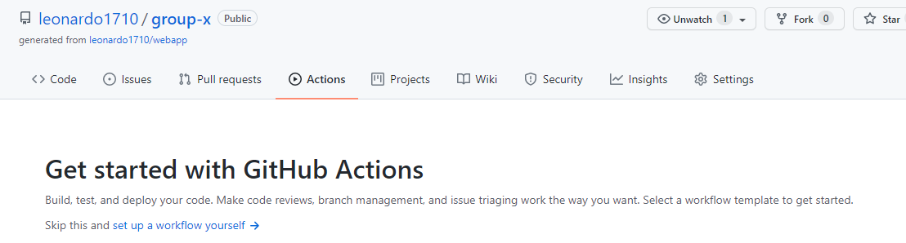
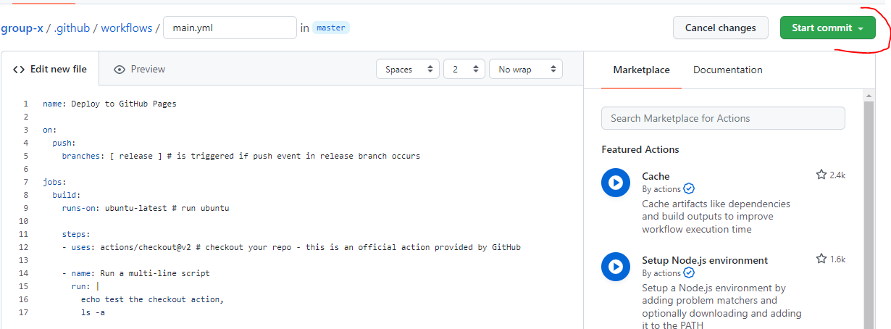
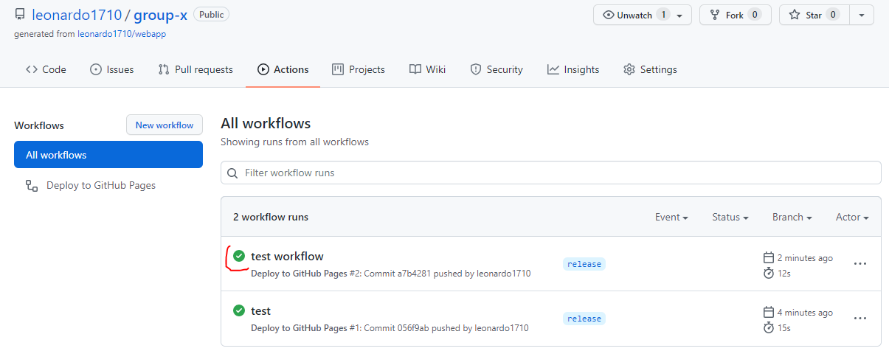
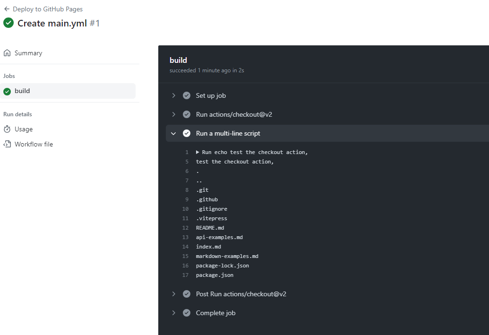
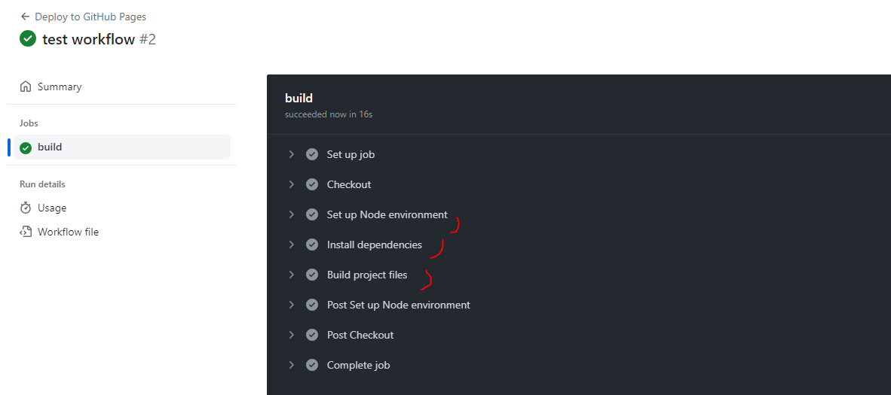
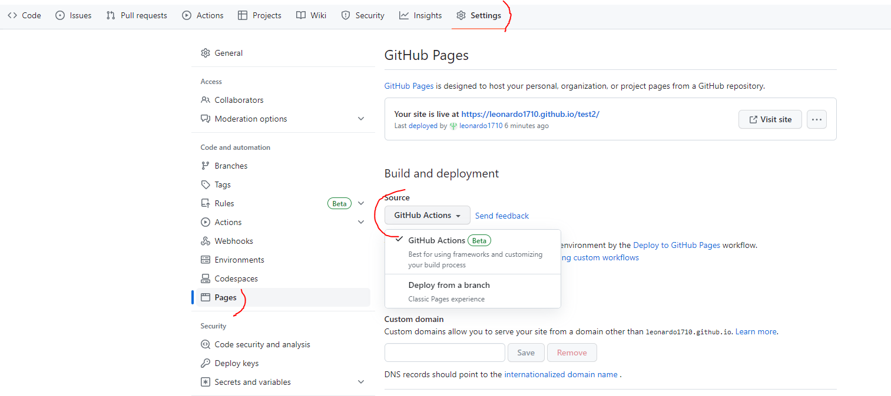

# {{ $frontmatter.title }}

# Aufbau einer CI/CD Pipeline mit Github Actions und Github Pages

## Aufgabenstellung
Nutzt das beim Git Arbeitsauftrag zur Verfügung gestellte Repository für folgende Aufgaben
* Erstellen eines Github Actions Workflows
* Konfiguration des Workflows
* Auto-deploy bei Push in einen bestimmten Branch
* Abgabe: URL der gehosteten Page auf Moodle + Teammitglieder

## Prerequisites
* Installation [Node.js](https://nodejs.org/en/download/)
* Installation [GIT](https://git-scm.com/downloads)
* Account bei [GitHub](https://github.com/)

## Was ist Github Actions?
[Github Actions](https://docs.github.com/en/actions) ist ein Entwicklungsservice des PaaS-Layer.
Mit Github Actions können Prozesse (Build, Test und Deployment) eines Projekts direkt von Github aus automatisiert werden. 
Diese Prozesse können durch bestimmte Ereignisse ausgelöst werden, wie z. B. das Pushen von Code, neue Releases usw.

Github Actions sind ereignisgesteuert: Durch festlegen von Befehlen, die ausgeführt werden sollen, wenn bestimmte Ereignisse (z. B. push to /main branch) eintreten. 
Stand 2023 sind in Github Actions 2000 Gratisminuten für private Repositories und unlimitierte Minuten für public Repositories verfügbar.

### Komponenten von Github Actions:
#### Workflows
Workflows können einfach zu einem GitHub Repository hinzugefügt werden. Ein Workflow ist eine automatisierte Prozedur, die aus einem oder mehreren [jobs](#jobs) besteht. Die Ausführung von Workflows kann durch festgelegte [events](#events) getriggert werden.
#### <a name="events">Events</a>
Events triggern Workflows. Beispielsweise kann ein `Push` in einen speziellen Branch einen Workflow triggern, der die Applikation deployed. Events können bis ins kleinste Detail angepasst werden. Folgende Liste enthält alle Events und beispielhafte Konfigurationssettings für diese: [Events](https://docs.github.com/en/actions/reference/events-that-trigger-workflows)
#### <a name="jobs">Jobs</a>
Jeder Workflow besteht aus einem oder mehreren Jobs. Jeder Job kann mehrere `steps` (Ausführungsschritte) beinhalten, die zur gleichen Zeit ausgeführt werden. Dazu werden sogenannte [runner](#runner) verwendet.
Standardmäßig werden diese Jobs parallel ausgeführt, man kann die Ausführung aber auch sequenziell einstellen (bspw. wenn ein Job ausgeführt sein muss, damit der nächste ausgeführt werden kann). [Sequentielle Ausführung von Jobs in Github Actions](https://docs.github.com/en/actions/reference/workflow-syntax-for-github-actions#example-requiring-dependent-jobs-to-be-successful).
#### <a name="actions">Actions</a>
Actions sind die kleinste Komponente eines jeden Workflows. Actions können entweder selbst erstellt, oder vordefinierte Actions der Github Community verwendet werden.
#### <a name="runner">Runner</a>
Runner sind die Server, auf denen die Workflows laufen. Github bietet einige vordefinierte Runner, die verwendet werden können. Es ist auch möglich, einen eigenen Runner zu hosten. Wenn Runner von Github selbst verwendet werden, kann zwischen verschiedenen Betriebssystem-Runnern gewählt werden: Ubuntu Linux, Microsoft Windows oder macOS.


## Was ist GitHub Pages?
GitHub Pages ist ein Static Site Hosting Service, mit dem Webpages direkt aus einem GitHub Repository deployed werden können. 
Es gibt drei Arten von GitHub Pages-Sites: Projekt-, Benutzer- und Organisationssites. Projektseiten sind mit einem bestimmten, auf GitHub gehosteten Projekt verbunden. Benutzer- und Organisationsseiten sind mit einem bestimmten Konto auf GitHub.com verbunden.

In dieser Übung werden wir GitHub Pages als Deploymentplattform für die Applikation, also für das von euch angelegte GitHub Repository, nutzen.
Die Source Files für eine Projektsite werden in demselben Repository abgelegt, dass ihr erstellt habt.

Standardmäßig wird bei GitHub Pages ein Branch namens `gh-pages` als Deploymentsource herangezogen.

### Limitierungen in GitHub Pages
* GitHub Pages dürfen nicht größer als 1GB sein
* Bandbreitenbegrenzung von 100GB im Monat
* 10 Builds/Stunde

## Wie würde ein manuelles Deployment der Applikation aussehen?
Würden wir das Projekt (Vitepress Webpage aus der letzten Exercise) manuell deployen, würden die Schritte wie folgt aussehen:
1. Branch mit Source Files auschecken
2. Dependencies der Applikation installieren (bspw. mit `npm i`)
3. Projekt Build -> Statische Files des Sourcecode generieren. In der zur verfügung gestellten Applikation wird der Buildprozess mit dem Command  `npm run docs:build` ausgeführt. Dabei wird ein `/dist` Folder mit den zu hostenden Files erstellt.
4. Die statischen Files bzw. der `/dist` Folder müssen dann auf einen Webserver transferiert werden

## Erstellung eines GitHub Actions Workflow
Um die zuvor beschriebenen Schritte mit GitHub Actions zu automatisieren, muss zuerst ein Workflow im GitHub Repository angelegt werden. In eurem Repository wählt den Tab `Actions` aus.

Hier kann man vorkonfigurierte Workflows auswählen (bspw. *Deploy Node.js to Azure Web App*, *Deploy to Amazon ECS*) oder einen eigenen Workflow anlegen.
Wählt hier bitte **set up a workflow yourself** aus:


GitHub Actions schlägt nun ein main.yml File vor. Schaut euch das File genau an. Wie ihr sehen könnt, gilt für einen Workflow in GitHub Actions:
* Workflows werden in einer YAML-Datei definiert, die sich im Verzeichnis .github/workflows eures Repos befindet
* Ein oder mehrere Events können den Workflow auslösen (bspw. `on: push` bzw. `on: pull_request`)
* jeder **Workflow** hat eine Anzahl von Jobs
* jeder **Job** startet auf einer neuen Instanz (bspw. Ubuntu-latest)
* jeder Job besteht aus mehreren **Steps**, in denen einzelne Aktionen oder Bash Commands ausgeführt werden
  
Fürs Erste löscht alle Inhalte des main.yml Files und fügt folgende Konfiguration ein.

::: details main.yml File
``` yaml
name: Deploy to GitHub Pages

on:
  push: 
    branches: [ release ] # is triggered if push event in release branch occurs

jobs:
  build:
    runs-on: ubuntu-latest # run ubuntu

    steps:
    - uses: actions/checkout@v2 # checkout your repo - this is an official action provided by GitHub

    - name: Run a multi-line script
      run: |
        echo test the checkout action,
        ls -a
```
:::

Dann muss ein Commit erstellt werden, damit das yml-File in eurem Repository ist. Das kann über die Github GUI gemacht werden, wenn man auf `Start commit` klickt. Hier muss nur mehr eine Commit Message eingegeben werden.


Damit ihr das neue yml-File auch **lokal** im `.github/workflows/` Ordner habt, müsst ihr noch die Änderung von der Remote pullen:

``` git
git pull
```

## Branch `release` erstellen
Erstellt einen Branch mit dem Namen `release` und wechselt in den Branch:

``` git
git branch release
git checkout release
```
Macht eine Änderung ein einem der Files (z.B. `index.md`), erstellt dann einen **Commit** und pusht den `release` Branch.

``` git
git add .
git commit -m "test the workflow"
git push
```
> Es kann sein, dass anstelle von `git push` zuvor noch der Branch veröffentlicht werden muss. Verwendet hierzu `git push --set-upstream origin release`, das erstellt den Branch in der Remote und pusht die Commits.


Nun solltet ihr im GitHub Repository unter `Actions` sehen, dass ein neuer Workflow getriggert wurde. Wird der Workflow gerade ausgeführt, wird der Status **gelb** indiziert, wurde der Workflow fertig ausgeführt, ist der Status **grün**. Wenn es Fehler beim Ausführen des Workflow gab, wird der Status **rot** eingefärbt:



Jeder Workflow kann dann, für weitere Details, angeklickt werden. In diesem Fall, werden in den Workflow Details die Folder des Repositories aufgelistet (`ls -a` Command aus dem yml-File):



## Workflow adaptieren
Im nächsten Schritt werden wir den Workflow so aktualisieren, dass der vorher beschriebene **manuelle Build** automatisiert ausgeführt wird. Im Falle unserer  Applikation muss zuerst der Befehl `npm run docs:build` ausgeführt werden. Um `npm` Befehle ausführen zu können, muss auf der Instanz **Node.js** installiert werden. Dazu verwenden wir eine andere offizielle GitHub-Action, die `setup-node-action`.

Dazu werden erstmal die `echo` und `ls` Commands aus dem Skript gelöscht und durch die Genannten ersetzt:

::: details main.yml File

``` yaml
name: Deploy to GitHub Pages

on:
  push: 
    branches: [ release ] # is triggered if push event in release branch occurs
jobs:
  build:
    runs-on: ubuntu-latest # run ubuntu

    steps:
      - name: Checkout
        uses: actions/checkout@v2 # checkout your repo - this is an official action provided by GitHub

      - name: Set up Node environment
        uses: actions/setup-node@v3
        with:
          node-version: 18

      - name: Install dependencies
        run: npm i

      - name: Build project files
        run: npm run docs:build

```

:::

Nach dem nächsten gepushten Commit in den `release` Branch, sollte die Action neu getriggert werden und die Commands ausführen:



Damit wir den Workflow für das Deployment auf Github Pages einrichten können, muss Pages aktiviert werden. In Github unter ``Settings`` -> `Pages` muss als Source `Github Actions` ausgewählt werden:


Wenn ihr euch an die Schritte beim manuellen Deployment erinnert, muss jetzt nur noch der generierte `/dist` Folder in das **Publishing Directory** eurer GitHub Pages Site gepusht werden. 
Hierzu stellt Github Actions auch einige vorgefertigte Actions zur Verfügung. Einerseits müssen die Berechtigungen zum Schreiben in GH-Pages hinterlegt werden, andererseits muss der Pfad zum ``/dist`` Folder bekanntgegeben werden:

::: details main.yml File

``` yaml
name: Deploy to GitHub Pages

on:
  push: 
    branches: [ release ] # is triggered if push event in release branch occurs
jobs:
  build:
    runs-on: ubuntu-latest # run ubuntu
    permissions:
      contents: read
      pages: write
      id-token: write

    steps:
      - name: Checkout
        uses: actions/checkout@v2 # checkout your repo - this is an official action provided by GitHub

      - name: Set up Node environment
        uses: actions/setup-node@v3
        with:
          node-version: 18

      - name: Install dependencies
        run: npm i

      - name: Build project files
        run: npm run docs:build # creates a /dist directory with build files

      - name: Setup GH Pages
        uses: actions/configure-pages@v3

      - name: Upload artifact
        uses: actions/upload-pages-artifact@v1
        with:
          path: .vitepress/dist # path to build files directory

      - name: Deploy to GH Pages # deploy
        id: deployment
        uses: actions/deploy-pages@v1
```
:::

Wenn ihr jetzt in euer Github Repository schaut, solltet ihr unter den `Actions` den Workflow einsehen können. 
Ist der Workflow fehlerfrei durchlaufen könnt ihr unter ``Pages`` den Link zur deployten Github Page finden. Normalerweise in der Form `https://<YOUR_GITHUB_NAME.github.io/<YOUR_REPO_NAME`.
Besucht den Link um eure Seite anzusehen.
Sollte die VitePress Seite nicht wie erwartet aussehen (verzerrte Stylesheets), liegt das daran, dass einige Files nicht richtig geladen werden konnten. Hierzu muss im ``./vitepress/config.js`` File noch eine Projektbase hinterlegt werden, unter der deployt wird.
Auf Github Pages ist das euer **Repository Name** ([siehe Dokumentation](https://vitepress.dev/guide/deploy#setting-a-public-base-path)):

````js config.js
import { defineConfig } from 'vitepress'

// https://vitepress.dev/reference/site-config
export default defineConfig({
  base: "/YOUR_REPOSITORY_NAME/",  
  title: "Simple VitePress Site",
  description: "Training Page for Cloud Computing Course",
...
````

Sehr gut. Die CI/CD Pipeline ist fertig erstellt. Ab sofort wird die Seite immer automatisch neu deployed, wenn in den `release` Branch gepusht wird.

## Zusätzliche Ressourcen
[Introduction to Github Actions](https://docs.github.com/en/actions/learn-github-actions/introduction-to-github-actions)

[Workflow Syntax](https://docs.github.com/en/actions/reference/workflow-syntax-for-github-actions)


