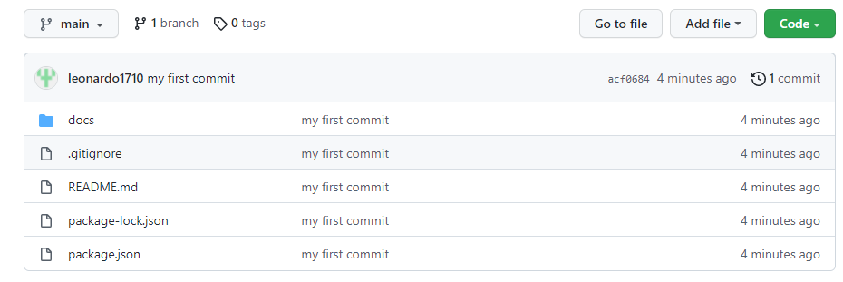
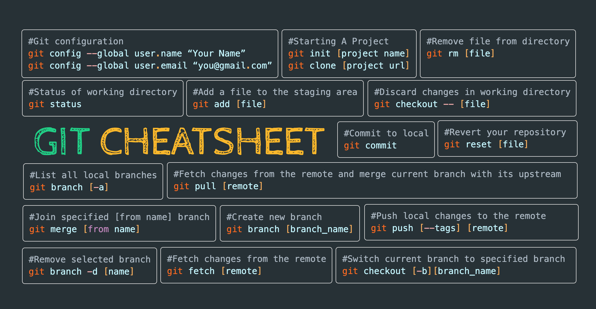

# {{ $frontmatter.title }}
## Aufgabenstellung
Aufgabe ist es, in Gruppen GIT anhand einer Web Applikation auszuprobieren. Folgende Schritte sind umzusetzen:
* [Beispiel-Repository Template](https://github.com/leonardo1710/cwa-template-web-app) als neues Repository in GitHub initiieren(muss nur 1 Teammitglied machen)
* Neues Repository lokal auf Maschinen klonen
* Durchführen von Änderungen (lokal) und `add` sowie `commit` Commans ausprobieren
* Änderungen ins Remote Repository pushen
* Erstellung von mindestens einem Branch je Teammitglied
* Änderungen im Branch vornehmen und Branch wieder in `main` Branch mergen
* Link zum Remote-Repository auf Moodle abgeben
  
## 1. Prerequisites
* Installation [Node.js](https://nodejs.org/en/download/)
* Installation einer IDE (bspw. [VSCode](https://code.visualstudio.com/download))
* Installation [GIT](https://git-scm.com/downloads)
* Account anlegen bei einem Git Repository Hosting Service (zB [GitHub](https://github.com/))

::: warning Projekt Setup
Das Projekt Setup muss nur 1 Teammitglied machen!
:::

## 2. Projekt Setup
Zum Ausprobieren von Git wird in diesem Arbeitsauftrag eine simple Web Applikation zur Verfügung gestellt. Somit sind **keine Programmiererfahrungen** im weitesten Sinne notwendig. Wollt ihr in eurem Team ein eigenes Projekt nutzen und an diesem mit GIT arbeiten ist das auch möglich. In diesem Fall bitte den Punkt [Beispiel-Repository Template kopieren](#projekt-klonen) überspringen.
Weiters muss nicht die **Git Bash** verwendet werden. Es kann auch ein Git Client wie [GitHub Desktop](https://desktop.github.com/) oder [Sourcetree](https://www.sourcetreeapp.com/) oder eine IDE ([VSCode](https://code.visualstudio.com/download)) verwendet werden.

### Beispiel-Repository Template kopieren (Github)
Bei der Web Applikation handelt es sich um eine Static Webpage, die mithilfe von [VitePress](https://vitepress.dev/) erstellt wurde. VitePress ist ein Static Site Generator, der dabei hilft statische Webpages sehr einfach zu erstellen. Dabei können Markdown Files, HTML-Files aber auch das Framework Vue.js verwendet werden. Das Projekt-Setup ist bereits integriert und funktioniert Out-of-the-Box. Für diesen Arbeitsauftrag sind keinerlei Vue.js Kenntnisse notwendig, wir konzentrieren uns nur auf die Versionskontrolle mit GIT. 

Als erstes muss **1 Teammitglied** das Template in den eigenen Github Repository Space kopieren mittel `Use this template` und `Create a new repository`:

[Use this template](./img/clone_template.png)

Danach einen Repository Namen vergeben und die Option `Public` ausgewählt lassen und das Repository erstellen. 

## Projekt lokal klonen 
Alle Teammitglieder müssen nun, das neu erstellte Repository lokal auf ihre Maschine klonen. 
An dieser Stelle können jetzt alle Teammitglieder mit dem `git clone` Command, das neue Repository klonen. Damit die anderen auch autonom in das Remote Repository pushen können, müssen sie noch als **Contributors** hinzugefügt werden:
* Auf GitHub im Repository unter `Settings` -> `Manage access` -> `Add people` -> GitHub Username oder E-Mail Adresse auswählen.
* 
Der `git clone` Command initialisiert bei allen anderen Teammitgliedern automatisch das notwendige Git Repository. Nun können alle Teammitglieder Änderungen in den Files machen, Änderungen in die Staging Area hinzufügen, committen und in die Remote pushen.

Dazu im Repository auf Github grünen Button `Code` (vorher "use this template") klicken und die HTTPS URL kopieren:

``` git
git clone <YOUR_URL>
```

## Projekt starten (optional)
Damit die Web Applikation ausgeführt werden kann, müssen zuerst alle notwendigen Dependencies installiert werden. Ausführung bspw. mithilfe der Command Shell im Projektordner:

``` shell
npm i 
```

Danach kann das Projekt im Development Modus ausgeführt werden:

```
npm run docs:dev
```

`npm i` installiert alle notwendigen (im `package.json` File hinterlegten) Dependencies. Dependencies sind Third-Party Code-Module (eg Libraries, Frameworks), die in Projekten verwendet werden können. 
Das Command `npm run docs:dev` ruft den im `package.json` hinterlegten Shell Command auf und führt diesen aus. Mithilfe dieser Commands können Software-Builds auch automatisiert ausgeführt werden. `npm run docs:dev` erstellt einen ausführbaren Build der Web Applikation (zB Markdown Files in HTML konvertieren) und startet einen lokalen Webserver auf dem die Applikation gehostet wird.
In meinem Fall: `http://localhost:5173/` (siehe Shell)

Um die Web Applikation anzusehen, kann die URL in einem Browser aufgerufen werden.

## Git im Team ausprobieren
Da das Initialsetup des Projekts jetzt bei allen Teammitgliedern funktioniert, kann mit der eigentlichen Git Übung begonnen werden. Folgendes ist zu tun:
* Jedes Teammitglied macht Änderungen im lokalen Repository und pusht diese in die Remote
* Jedes Teammitglied erstellt einen **Branch**, macht Änderungen in dem Branch und **merged** diesen Branch wieder in den `main` Branch
* Alles soll auch immer im Remote-Repository festgehalten werden!
  
Falls manche Schritte nicht klar sind, bitte noch einmal das Video von der letzten Übung schauen. Weiters gibt es ein Cheatsheet im Anhang, falls manche Commands entfallen sind.


## Allgemeine Git Commands

### `Add` Files im lokalen Repository
Der `add` Command fügt alle ausgewählten Änderungen einer sogenannten `Staging Area` hinzu. Alle Änderungen an Files der Staging Area sind in einem darauffolgenden `Commit` enthalten:

``` git
git add .
# Adds the files in the local repository and stages them for commit. 
```
> Änderungen aus der `Staging Area` entfernen mit: `git reset HEAD YOUR-FILENAME`

### `Commit` der Änderungen im lokalen Repository
Der `git commit` Command erzeugt einen **Snapshot** der aktuellen Projektversion (aus der Staging Area). Diese Snapshots werden in Git versioniert und nicht mehr geändert (außer man macht das explizit). Somit kann das Projekt immer auf eine bestimmte Version zurückgesetzt werden. 
``` git
git commit -m "my first commit"
```

### Änderungen in Remote **pushen**
Beim `git push` werden lokale Änderungen in das Remote Repository geladen. Das betrifft alle Commits, die noch nicht auf die Remote geladen wurden. 

``` git
git push origin main
```

Wurde das lokale Repository erfolgreich gepusht, solltet ihr diese Änderungen auch auf GitHub sehen können: Alle lokalen Files sind nun auch hier zu finden:



## 4. Änderungen der Remote **pullen**
Wurden von einem Teammitglied Änderungen auf die Remote gepusht, müssen alle anderen ihre lokalen Repositories aktualisieren (neuesten Stand des Projektes integrieren). Mittels `fetch` kann geschaut werden ob es Änderungen auf der Remote gibt. Mit `pull` werden die Änderungen in das lokale Repository gemerged.

``` git
git fetch origin main
git pull origin main
```

## Git Cheatsheet


## Weitere Ressourcen zum Lernen von Git
[Learn Git Branching](https://learngitbranching.js.org/)

[Oh my Git!](https://ohmygit.org/)

[GitHub Minesweeper](https://profy.dev/project/github-minesweeper)


## Abgabe 

Repository URL und Teammitglieder in [Moodle](https://moodle.fh-campuswien.ac.at/mod/assign/view.php?id=705479) abgeben.

