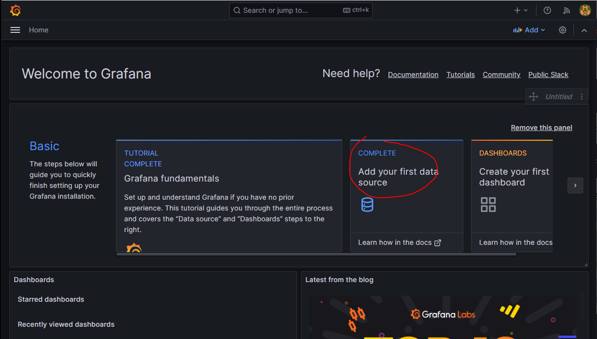
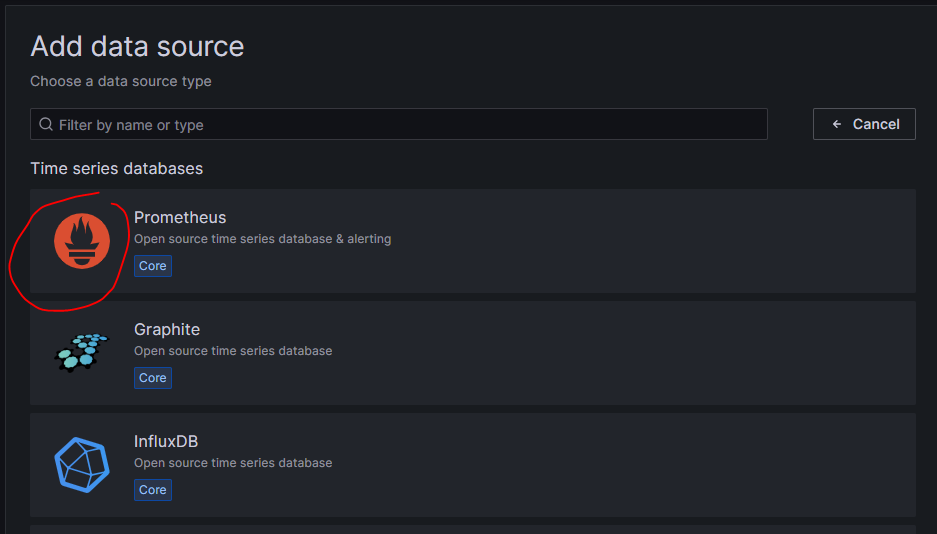
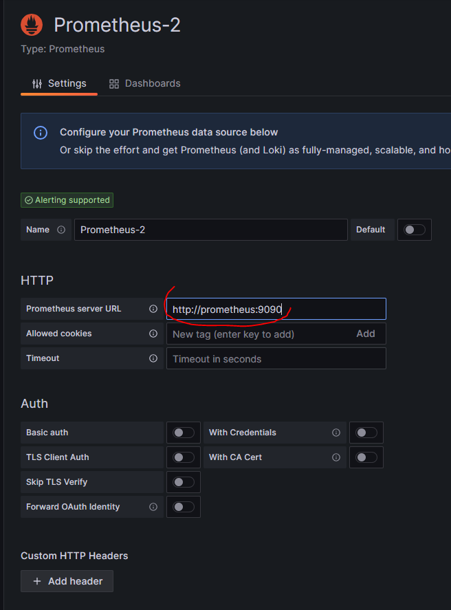
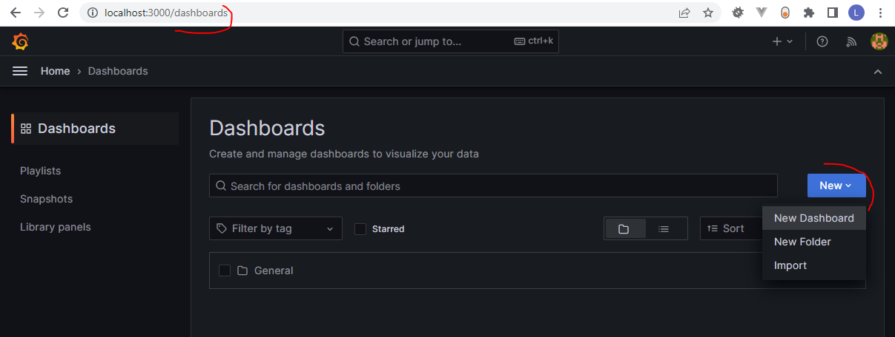
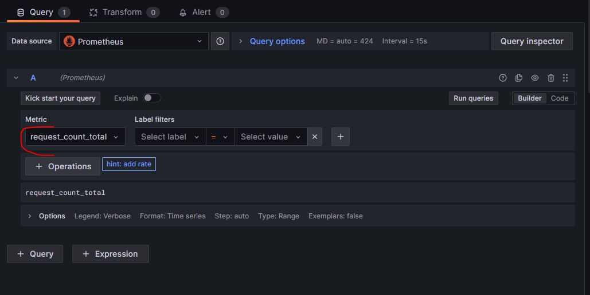
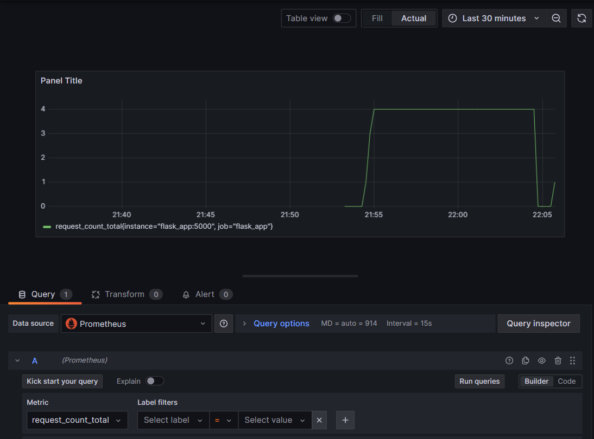
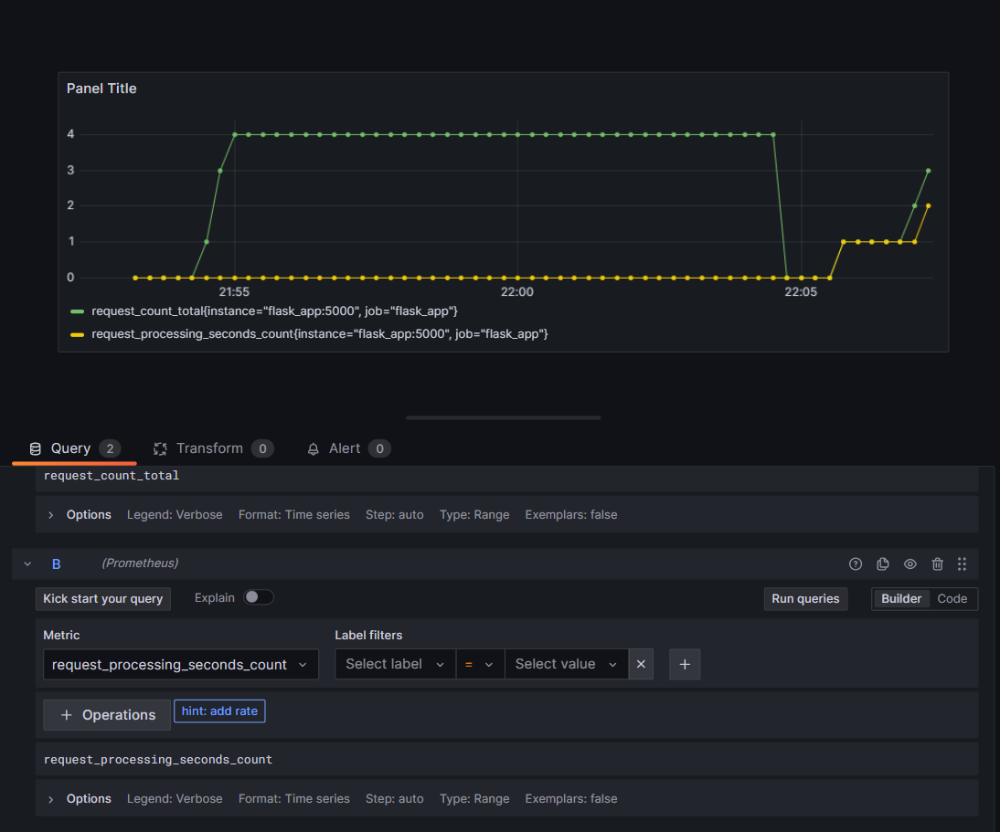

# {{ $frontmatter.title }}

## Aufgaben
* Überwachung mit Prometheus und Grafana einrichten
* Metriken von einer Python-Webanwendung (Flask) sammeln
* Metriken in Grafana visualisieren

## Intro
Service Monitoring ermöglicht es uns, spezifische Ereignisse in unseren Projekten zu analysieren, wie z.B. Datenbankaufrufe, API-Interaktionen und Requests, die Verfolgung der Ressourcennutzung usw.
Mithilfe des von Monitoring kann ungewöhnliches Verhalten leicht erkannt werden bzw. können nützliche Hinweise zur Problemfindung getrackt werden.
In dieser Übung werden wir Prometheus und Grafana verwenden, um eine Python-Webanwendung zu überwachen.
Wir werden alle unsere Services lokal in Docker-Containern ausführen und Docker Compose verwenden, um sie zu orchestrieren.

## Projektverzeichnis erstellen
Zuerst müssen wir ein neues Verzeichnis für unser Projekt erstellen:
```bash
mkdir my-monitoring-exercise
cd my-monitoring-exercise
```


In den nächsten Schritten werden wir mehrere Dateien und Verzeichnisse erstellen. Die Struktur des Projekts soll wie folgt aussehen:
```shell
my-monitoring-exercise/
├── app/
│   ├── main.py
│   ├── Dockerfile
│   └── requirements.txt
├── prometheus/
│   └── prometheus.yml
└── docker-compose.yml
```

Wir werden eine ``docker-compose.yml``-Datei haben, um unsere Services im Stammverzeichnis zu orchestrieren. Außerdem werden wir ein Verzeichnis für unsere Python-Webanwendung und ein Verzeichnis für Prometheus nutzen.
Die Python-App besteht aus einer ``main.py``-Datei, die die Logik der Flask-Webanwendung enthält, einem ``Dockerfile``, das beschreibt, wie die Python-App gebaut und ausgeführt wird, und einer ``requirements.txt``-Datei, die die Python-Abhängigkeiten enthält.
Die ``prometheus.yml``-Datei befindet sich im Prometheus-Verzeichnis und enthält die Konfiguration für Prometheus.

## Docker Container aufsetzen

Erstelle zusätzlich eine ``docker-compose.yml``-Datei im Rootverzeichnis und füge den folgenden Inhalt hinzu:
````yaml
version: "3.3"

services:
  prometheus:
    image: prom/prometheus
    ports:
      - "9090:9090"
    volumes:
      - ./prometheus/prometheus.yml:/etc/prometheus/prometheus.yml
    command:
      - '--config.file=/etc/prometheus/prometheus.yml'

  grafana:
    hostname: grafana
    image: grafana/grafana
    ports:
      - "3000:3000"
    environment:
      - GF_SECURITY_ADMIN_USER=admin
      - GF_SECURITY_ADMIN_PASSWORD=admin
    volumes:
      - grafana_data:/var/lib/grafana

  flask_app:
    build:
      context: .
      dockerfile: ./app/Dockerfile
    ports:
      - "5000:5000"
      - "8000:8000"

volumes:
  grafana_data:
````
Wir definieren drei Dienste: Prometheus, Grafana und unsere Python-Webanwendung.
Der wichtigste Punkt in der obigen Konfiguration ist das Einbinden der ``prometheus.yml``-Datei von unserem lokalen Verzeichnis in den Docker-Container.
Diese Datei enthält die Konfiguration zum Abrufen von Daten (Metriken) von unserem App-Dienst oder Python-Projekt. Ohne diese Datei können wir die benutzerdefinierten Metriken, die unser Projekt enthält, nicht sehen.

::: tip Learning Diary Exercise
Nimm dir ein paar Minuten Zeit, um zu verstehen, was hier passiert, und notiere deine Erkenntnisse im Learning Diary.

* Wo laufen die Dienste?
* Was ist die Reihenfolge der Ausführung der Services sein? (Welcher Dienst wird zuerst gestartet? Warum?)
* Recherchiere die Konfigurationen und Befehle, die Du noch nicht kennst
:::

## Prometheus konfigurieren

Erstelle nun eine ``prometheus.yml``-Datei im Verzeichnis ``prometheus`` und füge den folgenden Inhalt hinzu:
````yaml
global:
  scrape_interval: 15s # when Prometheus is pulling data from exporters etc
  evaluation_interval: 30s # time between each evaluation of Prometheus' alerting rules

scrape_configs:
  - job_name: flask_app   # your project name
    static_configs:
      - targets:
          - flask_app:8000
````
Diese Konfigurationsdatei teilt Prometheus mit, alle 15 Sekunden Daten vom Dienst "app" auf Port "5000" abzurufen.
Der Wert für ``job_name`` ist der Name deines Projekts. Der Name kann beliebig gewählt werden.

## Integration von Prometheus in der Flask Web App
Erstelle eine ``main.py``-Datei im Verzeichnis ``app`` und füge den folgenden Inhalt hinzu:

````python
from prometheus_client import start_http_server, Summary, Gauge, Counter, Histogram, generate_latest
from flask import Flask, Response
import random
import time
import threading
import logging

app = Flask(__name__)

# Configure logging
logging.basicConfig(level=logging.INFO)

# Create a metric to track time spent processing requests.
REQUEST_TIME = Summary('request_processing_seconds', 'Time spent processing request')

# Create a counter to track the total number of requests received.
REQUEST_COUNT = Counter('request_count', 'Total number of requests received')

# Create a histogram to track the distribution of request durations in seconds.
# The buckets represent specific intervals (0.1s, 0.3s, 0.5s, 0.7s, 1s, 2s, 5s, 10s).
REQUEST_DURATION = Histogram('request_duration_seconds', 'Histogram of request durations in seconds', buckets=(0.1, 0.3, 0.5, 0.7, 1, 2, 5, 10))

# Create a counter to track the total number of errors encountered.
ERROR_COUNT = Counter('error_count', 'Total number of errors encountered')

# Create a counter to track the count of HTTP response status codes.
# The counter is labeled with 'status_code' to distinguish between different status codes.
RESPONSE_CODE_COUNT = Counter('response_code_count', 'Count of HTTP response status codes', ['status_code'])

# Create a gauge metric to track the current number of active users.
CURRENT_USERS = Gauge('current_users', 'Current number of active users')


# Simulate processing time.
@REQUEST_TIME.time()
def process_request_time(t):
    """A dummy function that takes some time."""
    time.sleep(t)

# Simulate adding and removing active users (thread-safe)
def simulate_active_users():
    while True:
        # Simulate users joining or leaving
        active_users = random.randint(10, 50)  # Simulate between 10 to 50 active users
        CURRENT_USERS.set(active_users)
        logging.info(f"Current active users: {CURRENT_USERS.get()}")
        time.sleep(5)  # Update every 5 seconds

# Start a thread to simulate active users
simulate_users_thread = threading.Thread(target=simulate_active_users)
simulate_users_thread.start()

@app.route('/')
def process_request_cnt():
    # Increment the request count metric
    REQUEST_COUNT.inc()

    # Simulate random request processing time
    processing_time = random.uniform(0, 5)

    # Time the request
    process_request_time(processing_time)

    # Observe the request duration in the histogram
    REQUEST_DURATION.observe(processing_time)

    # Log metrics
    logging.info(f"Request count: {REQUEST_COUNT._value.get()}")
    logging.info(f"Processing time for request: {processing_time} seconds")
    logging.info(f"Request duration histogram: {REQUEST_DURATION.collect()[0].samples[0].value}")
    
    # Example response code handling
    response = Response(f"Success response with status code OK", status=200)
    RESPONSE_CODE_COUNT.labels(status_code=str(response.status_code)).inc()
    return response


# Route to simulate requests with occasional errors
@app.route('/simulate_error')
def simulate_error():
    # Increment the request count metric
    REQUEST_COUNT.inc()
    # Simulate random error occurrence
    if random.random() < 0.2:  # Adjust probability as needed (e.g., 0.2 for 20% chance)
        # Increment error count
        ERROR_COUNT.inc()
        logging.error("Simulated error occurred")
        logging.info(f"Total errors encountered: {ERROR_COUNT._value.get()}")

        response = Response(f"Simulated error response with status code 500 internal server error", status=500)
        RESPONSE_CODE_COUNT.labels(status_code=str(response.status_code)).inc()

        return response
    else:
        # Example response code is successful OK - 200
        response = Response(f"No error occurred - statuscode: OK", status=200)
        RESPONSE_CODE_COUNT.labels(status_code=str(response.status_code)).inc()
        return response

@app.route('/metrics')
def handle_metrics():
    # Expose the metrics for scraping
    return generate_latest()

if __name__ == '__main__':
    # Start up the server to expose the metrics.
    start_http_server(8000)

    # Start the Flask app
    app.run(host='0.0.0.0', port=5000)
````


Dies ist eine einfache Flask-Webanwendung, die drei Endpunkt unter ``localhost:5000`` bereitstellt.
Um Metriken von unserer Anwendung zu sammeln, verwenden wir die [Prometheus Client Library](https://github.com/prometheus/client_python).

Folgende Metriken werden im Skript genutzt:
* ``REQUEST_TIME`` (Summary): Misst die Zeit, die für die Verarbeitung von Anfragen benötigt wird.
* ``REQUEST_COUNT`` (Counter): Zählt die Gesamtanzahl von Anfragen.
* ``REQUEST_DURATION`` (Histogram): Hält die Verteilung der Anfragedauern in Sekunden fest, mit spezifischen Intervallen (Buckets).
* ``ERROR_COUNT`` (Counter): Zählt die Gesamtzahl von Fehlern, die aufgetreten sind.
* ``RESPONSE_CODE_COUNT`` (Counter): Zählt die Häufigkeit der HTTP-Antwortstatuscodes, unterschieden durch status_code.
* ``CURRENT_USERS`` (Gauge): Zeigt die aktuelle Anzahl aktiver Benutzer an.

Funktionen und Routen (Endpoints):
* ``process_request_time(t)``: Simuliert die Verarbeitungszeit einer Anfrage (randomisiert).
* ``simulate_active_users()``: Simuliert das Hinzufügen und Entfernen aktiver Benutzer in einem separaten Thread.
* ``process_request_cnt()``: Stellt die Hauptroute ``/`` zur Verfügung, inkrementiert Metriken für Anfragen und Anwortcodes, simuliert eine zufällige Verarbeitungszeit und loggt Metriken.
* ``simulate_error()``: Stellt die Route ``/simulate_error`` zur Verfügung, inkrementiert Fehler- und Anfragemetriken, simuliert gelegentlich auftretende Fehler und loggt diese.
* ``handle_metrics()``: Exponiert die Metriken über den Endpunkt ``/metrics`` für das Abfragen durch Prometheus.

Danach erstellen wir ein ``Dockerfile`` und ein ``requirements.txt`` um unser Projekt zu builden:

**Dockerfile**

````dockerfile
# Base image
FROM python:3.9-slim

# Set the working directory
WORKDIR /app

# Copy the application code
COPY /app .

# Install dependencies
RUN pip install --no-cache-dir -r requirements.txt

# Expose the port on which the Flask app runs
EXPOSE 5000
# Expose the port from prometheus_client metrics
EXPOSE 8000

# Set the entry point command
CMD ["python", "main.py"]
````

::: tip Learning Diary Exercise
Beantworte folgende Fragen zum Dockerfile im Learning Diary

* Was ist das Basisimage?
* Was ist das Working Directory?
* Welcher Command wird beim Starten des Containers ausgeführt und warum?
* Recherchiere Konfigurationen und Befehle, die Du noch nicht kennst.
:::

**requirements.txt**

````text
Flask==2.2.2
Werkzeug==2.2.2
prometheus_client==0.11.0
````

Um die Services zu starten, führe den folgenden Befehl im Rootverzeichnis aus:

````shell
docker-compose up -d
````

Status-Check der Services:

````shell
docker-compose ps
````

Nun sind alle Services über den Browser erreichbar:
* Grafana: ``localhost:3000``
* Prometheus: ``localhost:9090``
* Python Web App: ``localhost:5000``

### Grafana einrichten
In diesem Abschnitt verwenden wir Prometheus als Datenquelle, um Metriken in Grafana-Diagrammen anzuzeigen.

Navigiere zu ``localhost:3000`` (im Browser), um die Loginpage von Grafana zu sehen, und verwende sowohl für Benutzername als auch Passwort ``admin``.
Anschließend werden wir aufgefordert, ein neues Passwort hinzuzufügen, das wir für unsere lokalen Zwecke unverändert lassen können.

Nach erfolgreicher Anmeldung solltest Du das Standard-Dashboard von Grafana sehen und die Option "Data Sources" auswählen können.



Als nächstes müssen wir Prometheus als Datenquelle hinzufügen. Klicke auf den Button "Add data source" und wähle Prometheus aus der Liste aus.



Nun müssen wir Prometheus als Datenquelle konfigurieren. Gib unter URL die Adresse ``http://prometheus:9090`` ein, die der Docker-Dienstname und Port ist, den wir erstellt haben.
Für alle anderen Einstellungen können die Standardwerte verwendet werden. Klicke abschließend auf die Schaltfläche "Save & Test", um die Datenquelle zu speichern.



Jetzt ist unser Grafana bereit, Metriken darzustellen, die von Prometheus stammen.
Navigiere zu ``http://localhost:3000/dashboards``, um ein neues Dashboard zu erstellen.
Klicke auf ``New`` und dann auf ``New Dashboard``, um die Initialisierung zu starten:



Anschließend auf ``Add visualization`` klicken und wählen Prometheus-Datenquelle auswählen.

Im ``Query``-Panel können wir unsere Abfragen eingeben, um die Metriken von Prometheus abzurufen. Wähle ``request_count_total``, um die Anzahl der Anfragen abzufragen, die von unserer Anwendung empfangen wurden.
Klicke dann auf die Schaltfläche ``Run Queries``, um die Ergebnisse zu sehen:



Um einige Anfragen zu simulieren, öffnen wir einen neuen Browser-Tab und navigieren zu ``http://localhost:5000``. Jedes Mal, wenn Du die Seite aktualisierst, wird die Anzahl der Anfragen um eins erhöht.

> Note: Es kann einige Sekunden dauern, bis die Metriken in Grafana aktualisiert werden.



Füge anschließend noch die restlichen Queries des Python Skripts hinzu und analysiere welche Metriken sich wann verändern.



> Note: Um die Resultate in Grafana genauer darzustellen kannst du die Ansicht auf ``Last 5 minutes`` einstellen.


::: tip Learning Diary Exercise
Probiere unterschiedliche Endpunkte aus (``http://localhost:5000``, ``http://localhost:5000/simulate_error``,``http://localhost:5000/metrics``) - rufe die Endpunkte auch öfters auf, um unterschiedliche Metriken zu erhalten. Analysiere was sich im Grafana Dashboard ändert, und wieso. Notiere in deinem Learning Diary.
:::

## Submission
* Learning Diary in Moodle