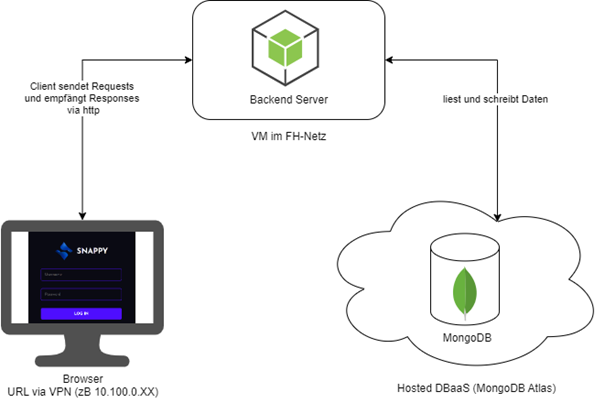
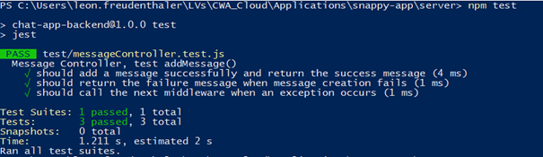
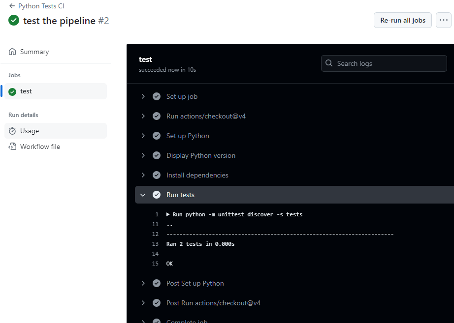
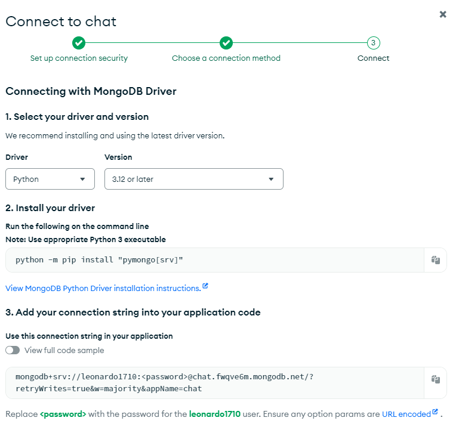

# {{ $frontmatter.title }}

## Intro
Im Zuge des Cloud Abschlussprojekts ist eine zur Verfügung gestellte Chat-App, die aus **mehreren Services** besteht, so zu konfigurieren, dass ein Deployment **so einfach wie möglich** funktioniert. 
Dabei wird der Software Stack Schritt für Schritt, von einem lokalen Deployment, bis zum Deployment auf einer VM und unter Verwendung weiterer Cloud Services aufgesetzt.
U.a ist ein **DBaaS** (MongoDB Atlas) aufzusetzen und in die App zu integrieren, sowie eine **CI-Pipeline** in GitHub Actions aufzusetzen. 
Die Applikation soll anschließend auf einer VM deployed werden und über ein VPN an die IP-Adresse dieser VM (bspw.: 10.100.0.XX) erreichbar sein.

::: tip
Schreibt für alle anstehenden Aufgaben alle Schritte auf, die zur Reproduktion notwendig sind, da ihr möglicherweise aufgefordert werdet, diese bei der Demonstration zu zeigen.
:::

## Snappy - die Chat-App
Den Source Code für die Chat-App findet ihr [hier](https://github.com/leonardo1710/AbschlussprojektCloud2023).
Das Projekt basiert auf einem public Repository von [Github](https://github.com/koolkishan/chat-app-react-nodejs) und wurde so adaptiert, dass es für das Abschlussprojekt sinnvoll nutzbar ist. 
Bei Snappy handelt es sich um eine Web-Applikation, die aus einem **Frontend** (HTML, CSS, JS -> im `/website` Verzeichnis) und einem **Backend Server** (Flask Python -> im `/backend-server` Verzeichnis) besteht. 
Zur Persistierung soll eine **NoSQL-Datenbank** (MongoDB) genutzt werden. Die entsprechende Anbindung des Backend an die Datenbank ist bereits programmiert, eine DB-Instanz muss jedoch noch zur Verfügung gestellt werden und ggf. Konfigurationsfiles adaptiert werden.

Das finale System soll wie folgt aussehen:



## 1. Source Code klonen und Chat-App lokal ausführen (5 Pkt)
Klont den [Source Code](https://github.com/leonardo1710/AbschlussprojektCloud2023) der App lokal auf eure Maschine und folgt den Anweisungen des ``Readme.md`` Files, um die App lokal auszuführen. 
Auch wenn die Applikation schlussendlich in eurer VM deployed werden soll, ist es leichter die notwendigen Schritte bis zur Ausführung einmal lokal zu testen. 
Läuft die App lokal fehlerfrei, können viele Fehlerquellen beim „richtigen“ Deployment ausgeschlossen werden. 

Im ``Readme.md`` File sind alle notwendigen Schritte zur Ausführung des Backend Server und der Web Applikation beschrieben. 
Damit die App funktioniert, muss auch eine MongoDB-Instanz erstellt werden. Ihr könnt entweder eine MongoDB lokal installieren oder in einem Docker Container starten (recommended). Anschließend ist nur die URL zur DB im ``.env`` File (``/backend-server/.env``) korrekt zu hinterlegen.

::: warning Kontrollfragen
* Wie wird das Python Backend gestartet?
* Was ist ein `.env` File?
* Wie wird ein MongoDB Container erstellt?
* Welche Attribute des MongoDB Containers sind notwendig für die Integration in die Chat-App?
:::

## 2.	Eigenes Repository der Chat-App erstellen (2 Pkt)
Erstellt ein eigenes Github Repository des geklonten Projekts für euer Team. 
Ihr braucht es nicht nur für die zu erstellende CI-Pipeline, es wird euch auch die Zusammenarbeit beim Projekt erleichtern. 
Achtet darauf, dass ihr die ``.env`` Files **nicht mit Git versioniert** – diese können Passwörter enthalten und sollten deshalb nicht in einem öffentlichen Repository einsehbar sein - sondern von jedem Mitglied manuell lokal angelegt werden.
Fügt alle Teammitglieder als Collaborators hinzu.

::: warning Kontrollfragen
* Wie legt man ein GitHub Repository an?
* Wie können Kollaboratoren dem Repository hinzugefügt werden?
* Was ist notwendig, damit bestimmte Files in Git **nicht** versioniert werden?
:::

## 3.	CI-Pipeline mit Github Actions (5 Pkt)
Anschließend ist eine CI-Pipeline in eurem Github Repository einzurichten. Die Applikation soll zukünftig bei einem Push in einen ``„staging“`` Branch automatisiert getestet werden. 
Aus diesem Grund wurden 2 Dummy Unit-Tests für Demozwecke hinzugefügt.
Um die Tests lokal auszuführen, muss im ``/backend-server`` Verzeichnis der Command `python -m unittest tests/test_app.py` ausgeführt werden. Alternativ kann auch folgender Command ausgeführt werden `python -m unittest discover -s tests`.

Ausgabe, wenn Tests korrekt ausgeführt wurden:



Aufgabe:
Erstellt einen Github Actions Workflow in eurem Repository, der beim Push in den Branch ``“staging“`` die Tests (siehe oben) ausführt.
Notwendige Schritte im Workflow:
-	Checkout Repository
-	Python Environment aufsetzen
- Python pip installieren und ggf. upgraden
-	Python Dependencies installieren
-	Tests ausführen

> Hinweise: nachdem die Tests im ``/backend-server`` Verzeichnis liegen, muss im Workflow das `working-directory` dementsprechend angepasst werden. 
Dazu muss das default working-directory auf ``/backend-server`` eingestellt werden (siehe [Github Actions Dokumentation](https://docs.github.com/en/actions/using-workflows/workflow-syntax-for-github-actions#defaultsrun)). 

Folgende Ausgabe ist bei einem korrekten Durchlauf des Workflows zu erwarten:



::: warning Kontrollfragen
* Wie wird ein GitHub Actions Workflow erstellt?
* Was sind Events in GitHub Actions und wie werden sie konfiguriert?
* Wozu könnte ein Workflow, in dem Tests ausgeführt werden, dienen?
:::

## 4. DBaaS MongoDB Atlas (3 Pkt)
Anstelle einer lokalen MongoDB Datenbank, soll MongoDB als DBaaS in das System integriert werden. Dh. eure DB Instanz wird direkt bei einem Cloud Provider, in diesem Fall Atlas (https://www.mongodb.com/atlas/database), gehostet. 
Erstellt dazu einen neuen Account und legt eine DB an. Um eure gehostete DB mit der App zu verbinden, muss die MONGO_URL anschließend im `.env` File adaptiert werden. Die Verbindungs-URL zur gehosteten DB findet ihr unter `Connect` -> `Drivers`. Hier könnt ihr den Connection String kopieren.



Da ihr nun eine zentrale DB in der Cloud nutzt, könnt ihr miteinander über mehrere PCs hinweg chatten - die Daten werden nun synchronisiert.

::: warning Kontrollfragen
* Was ist ein DBaaS?
* Welche Adaptionen waren notwendig, um das DBaaS zu integrieren?
:::

## 5. Dockerisiertes Deployment (5 Pkt)
In diesem Schritt soll die Chat-App (und alle zugehörigen Services) "dockerisiert" werden, damit sie mit nur einem einzigen Befehl in der Shell gestartet und einem weiteren gestoppt werden kann. Achtet auf eine performante und klare Umsetzung (Layer-Caching, Reihenfolge der Services, ...).

::: warning Kontrollfragen
* Erkläre das docker-compose.yml File
* Wie sollten die Services gereiht werden und warum?
* Was ist Layer-Caching in Docker?
* Was wäre im Automatisierungs-Setup notwendig, wenn die DB nicht gehostet, sondern lokal ausgeführt werden soll?
:::

## 6. Deployment der Applikation (10 Pkt)
Läuft die Chat-App fehlerfrei inkl. aller Komponenten lokal auf euren Geräten, kann nun mit dem Deployment auf eurer VM begonnen werden. 
Jede*m wurde eine VM zugeteilt (siehe Mail) - ihr könnt als Team jedoch auch nur eine einzige Maschine nutzen. 

Zu Beginn muss die VM eingerichtet werden:
* Verbindet euch via [Proxmox](https://csdc-server1.fh-campuswien.ac.at/) und euren Portal-Credentials mit eurer Maschine
* VM Credentials wurden auch in der Mail zugesandt
* Download und Installation von [WireGuard](https://www.wireguard.com/install/) falls noch nicht installiert - VPN wird genutzt, da die Maschinen nicht über ein öffentliches Netz erreichbar sind.
* Konfiguriert Netplan in eurer VM um eine SSH Verbindung zu ermöglichen
* Aktiviert VPN und verbindet euch via SSH zu eurer Maschine
* Klont das Repository in der VM
* Deployed die Chat-App (ggf. Installation weiterer Software notwendig!)
* Die App sollte nun via VPN auf dem richtigen Port erreichbar sein. z.B.: ``10.100.0.xy:3000``

**Netplan Konfiguration**
In `/etc/netplan` adaptiert das File `00-installer-config.yaml` wie folgt - `xy` ist durch eure Nummer zu ersetzen:

``` yaml
network:
  version:2
  ethernets:
   ens18:
    addresses:
      - 10.100.0.xy/24
    gateway4: 10.100.0.254
    nameservers: 
      addresses: [8.8.8.8, 9.9.9.9]
    mtu: 2450
```

Danach mittels `sudo netplan apply` die neue Konfiguration laden.

**VPN Tunnel in Wireguard einrichten**
`Neuer Tunnel hinzufügen` -> `einen leeren Tunnel hinzufügen`:

```
[Interface]
PrivateKey = DEIN_PRIVATER_KEY
Address = 10.255.0.xy/25

[Peer]
PublicKey = YnNA4eb2Q51Z/dEVqhRnEnZtHdX6trZ8IOksBNlZigQ=
AllowedIPs = 10.255.0.0/24, 10.100.0.0/24
Endpoint = 77.237.53.200:51820
```

::: warning Kontrollfragen
* Was ist ein VPN und wie wird es im Zuge dieses Projekts genutzt?
* Was ist Netplan? Erkläre was im `00-installer-config.yaml` File konfiguriert wird
* Was musste auf der Ubuntu VM zusätzlich installiert werden, damit das Projekt deployed werden konnte und warum?
:::


## 7.	Demo und Abnahmegespräch (10 Pkt)
Am **3.9.2024** wird das Abschlussprojekt abgenommen. Jedes Team präsentiert die Umsetzung. 
* alle Entscheidungen, die getroffen wurden, müssen begründet und erklärt werden können und anderen Möglichkeiten (zB andere Deployment-Strategien) gegenübergestellt – diskutiert – werden.
* einzelne Schritte müssen erklärt werden können - Orientierung: Kontrollfragen


### Hilfreiche Ressourcen
* Verwendet [ChatGPT](https://chat.openai.com/) oder [Google](https://www.google.com/) um euch über die einzelnen Themen zu informieren
* Arbeitsaufträge: git, Github Actions, Docker, Docker Compose
* [Dockerize a Node App](https://dev.to/otomato_io/how-to-optimize-production-docker-images-running-nodejs-with-yarn-504b)
* [Run MongoDB in Docker Container](https://www.geeksforgeeks.org/how-to-run-mongodb-as-a-docker-container/)


