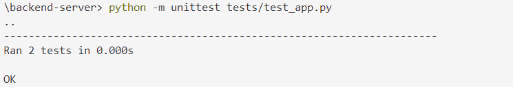

# {{ $frontmatter.title }}

## Intro
Im Zuge des Cloud Abschlussprojekts ist eine zur Verfügung gestellte Chat-App, die aus **mehreren Services** besteht, so zu konfigurieren, dass ein Deployment **so einfach wie möglich** funktioniert. 
Weiters ist ein **DBaaS** (MongoDB Atlas) aufzusetzen und in die App zu integrieren, sowie eine **CI-Pipeline** aufzusetzen. 
Die Applikation soll anschließend auf einer VM deployed werden und über eine VPN an die IP-Adresse dieser VM (bspw.: 10.100.0.XX) erreichbar sein.

## Snappy - die Chat-App
Den Source Code für die Chat-App findet ihr [hier](https://github.com/leonardo1710/AbschlussprojektCloud2023).
Das Projekt basiert auf einem public Repository von [Github](https://github.com/koolkishan/chat-app-react-nodejs) und wurde so adaptiert, dass es für das Abschlussprojekt sinnvoll nutzbar ist. 
Bei Snappy handelt es sich um eine Web-Applikation, die aus einem **Frontend** (HTML, CSS, JS -> im `/public` Verzeichnis) und einem **Backend Server** (Node.js -> im `/server` Verzeichnis) besteht. 
Zur Persistierung soll eine **NoSQL-Datenbank** (MongoDB) genutzt werden. Die entsprechende Anbindung des Backend an die Datenbank ist bereits verfügbar, eine DB-Instanz muss jedoch noch zur Verfügung gestellt werden.

Das finale System soll wie folgt aussehen:

### 1. Source Code klonen und Chat-App lokal ausführen (8 Pkt)
Klont den [Source Code](https://github.com/leonardo1710/AbschlussprojektCloud2023) der App lokal auf eure Maschine und folgt den Anweisungen des ``Readme.md`` Files, um die App lokal auszuführen. 
Auch wenn die Applikation schlussendlich in eurer VM deployed werden soll, ist es leichter die notwendigen Schritte bis zur Ausführung einmal lokal zu testen. 
Läuft die App lokal fehlerfrei, können viele Fehlerquellen beim „richtigen“ Deployment ausgeschlossen werden. 

Im ``Readme.md`` File sind alle notwendigen Schritte zur Ausführung des Backend Server und der Client Applikation beschrieben. 
Damit die App funktioniert, muss auch eine MongoDB-Instanz erstellt werden. 
Ihr könnt entweder eine MongoDB lokal installieren, in einem Docker Container starten, oder direkt eine MongoDB Instanz bei Atlas (https://www.mongodb.com/atlas/database) hosten. 
Anschließend ist nur die URL zur DB im ``.env`` File (``/server/.env``) korrekt zu hinterlegen.

### 2.	Eigenes Repository der Chat-App erstellen (2 Pkt)
Erstellt ein eigenes Github Repository für euer Team. 
Ihr braucht es nicht nur für die zu erstellende CI-Pipeline, es wird euch auch die Zusammenarbeit beim Projekt erleichtern. 
Achtet darauf, dass ihr die ``.env`` Files **nicht mit Git versioniert** – diese können Passwörter enthalten und sollten deshalb nicht in einem öffentlichen Repository einsehbar sein - sondern von jedem Mitglied manuell lokal angelegt werden.
Fügt alle Teammitglieder als Collaborators hinzu.

### 3.	CI-Pipeline mit Github Actions (5 Pkt)
Abschließend ist eine CI-Pipeline in eurem Github Repository einzurichten. Die Applikation soll zukünftig bei einem Push in einen ``„staging“`` Branch automatisiert getestet werden. 
Aus diesem Grund wurden 3 kleine Unit-Tests für Demozwecke hinzugefügt.
Um die Tests lokal auszuführen, muss im ``/server`` Verzeichnis der Command `npm test` ausgeführt werden:

Aufgabe:
Erstellt einen Github Actions Workflow in eurem Repository, der beim Push in den Branch ``“staging“`` die Tests (siehe oben) ausführt.
Notwendige Schritte im Workflow:
-	Checkout Repository
-	Node Environment aufsetzen
-	Node Dependencies installieren (npm ci)
-	Tests ausführen (npm test)

> Hinweise: nachdem die Tests im ``/server`` Verzeichnis liegen, muss im Workflow das `working-directory` dementsprechend angepasst werden. 
Dazu muss das default working-directory auf ``/server`` eingestellt werden (siehe [Github Actions Dokumentation](https://docs.github.com/en/actions/using-workflows/workflow-syntax-for-github-actions#defaultsrun)). 
Weiters wird es notwendig sein, der Action `setup-node` dieses Subdirectory bekannt zugeben (siehe [Stackoverflow Post](https://stackoverflow.com/questions/68639588/github-actions-dependencies-lock-file-is-not-found-in-runners-path)).

Folgende Ausgabe ist bei einem korrekten Durchlauf des Workflows zu erwarten:

### 4. Deployment der Applikation (15 Pkt)
Läuft die Chat-App fehlerfrei inkl. aller Komponenten lokal auf euren Geräten, kann nun mit dem Deployment auf eurer VM begonnen werden. 
Die Chat-App (und alle zugehörigen Services) soll mit nur einem einzigen Command in der Shell gestartet und einem weiteren gestoppt werden können.
Wie ihr das umsetzt, bleibt euch überlassen (Docker-Compose, Shell Skripts, …). 
Weiters soll das Frontend über den Port 80 eurer IP (via VPN) erreichbar sein. Dazu ist ein Webserver wie Nginx oder Apache notwendig.
Falls ihr in Schritt 1 noch nicht MongoDB Atlas als DBaaS genutzt habt, muss spätestens jetzt eine Instanz angelegt und ins Projekt integriert werden (``MONGO_URL`` in ``/server/.env`` aktualisieren).

> Hinweise: 
> * Wenn ihr das Frontend (``/public``) und das Backend (``/server``) via Dockerfile konfiguriert, müsst ihr die Dependencies ``package.json`` und ``package-lock.json`` in die jeweiligen Container kopieren und anschließend ``npm i`` ausführen. Wie beim ``requirements.txt`` in der Python Demo App. Außerdem ist ein `.dockerignore` File notwendig, das die Dependencies des `node_module` Folder beinhaltet, um die Dependencies nicht jedes Mal neu zu installieren (siehe [hier](https://stackoverflow.com/questions/31789770/what-are-the-files-that-the-dockerignore-works-on)).
> * Nginx und Apache können auf der VM installiert werden oder in einem Docker Container laufen. Achtet darauf, dass der Port 80 auf eurer VM auf den Port 80 des Containers gemappt wird (und keine anderen Prozesse auf Port 80 laufen).
> * Im ``/public/utils/APIRoutes.js`` File muss die URL zum Backend Server angepasst werden, wenn ihr das Backend nicht unter ``localhost:5000`` deployed.
> * Testet das Deployment unbedingt lokal, bevor ihr es auf eurer VM deployed! 

### 5.	Demo und Abnahmegespräch
Am **4.8.2023** wird das Abschlussprojekt abgenommen. Jedes Team präsentiert die Umsetzung. 
> Wichtig: alle Entscheidungen, die getroffen wurden, müssen begründet und erklärt werden können und anderen Möglichkeiten (zB andere Deployment-Strategien) gegenübergestellt – diskutiert – werden. Jedem Teammitglied werden zusätzlich 2 Fragen aus dem Fragenkatalog gestellt.
Bewertung (insgesamt 50 Punkte):
-	Arbeitsauftrag 30 Punkte (siehe oben)
-	Theoriefragen 20 Punkte

### Hilfreiche Ressourcen
* Verwendet [ChatGPT](https://chat.openai.com/) oder [Google](https://www.google.com/) um euch über die einzelnen Themen zu informieren
* Arbeitsaufträge: git, Github Actions, Docker, Docker Compose
* [Dockerize a Yarn/Node App](https://dev.to/otomato_io/how-to-optimize-production-docker-images-running-nodejs-with-yarn-504b)
* [React App in Docker serving on Nginx](https://www.youtube.com/watch?v=Sm8GbC02MlE)
* [Run MongoDB in Docker Container](https://www.geeksforgeeks.org/how-to-run-mongodb-as-a-docker-container/)

