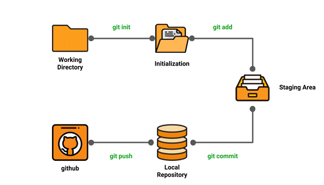
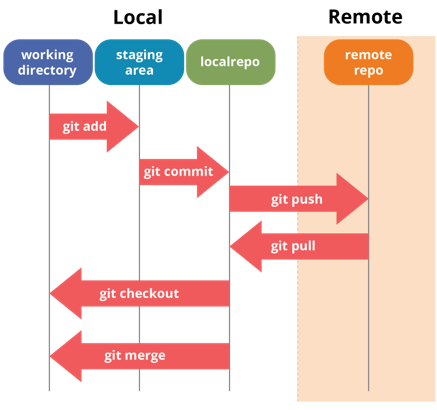
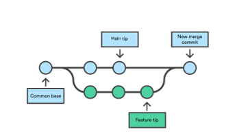
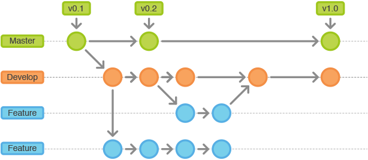

# {{ $frontmatter.title }}

## Was ist PaaS?

Platform-as-a-Service ist eine vollständige Entwicklungs- und Bereitstellungsumgebung in der Cloud, über die man Zugang zu den erforderlichen Ressourcen erhält, um verschiedenste Lösungen bereitstellen zu können – von einfachen cloudbasierten Apps bis hin zu ausgereiften cloudfähigen Unternehmensanwendungen. Somit richtet sich PaaS vor allem an Entwickler:innen.

Genau wie IaaS umfasst PaaS Infrastrukturkomponenten wie Server, Speicher und Netzwerkelemente. Zusätzlich bietet PaaS auch Middleware, Entwicklungstools, BI-Dienste (Business Intelligence), Datenbankverwaltungssysteme und mehr. Mit PaaS lässt sich der gesamte Webanwendungs-Lebenszyklus unterstützen – vom Erstellen, Testen und Bereitstellen der Anwendungen bis hin zu deren Verwaltung und Aktualisierung.

Der einfachste Weg, sich den Unterschied zwischen IaaS und PaaS zu merken, ist, dass **IaaS virtuelle Maschinen und damit verbundene Dienste anbietet**. Um auf einer IaaS-Plattform arbeiten zu können, braucht man jemanden, der sich mit dem Betrieb eines **Betriebssystems** auskennt. Mit anderen Worten: man braucht einen **Systemadministrator**. **PaaS** hingegen ist für **Entwickler:innen** gedacht. Das Hauptziel der PaaS-Dienste besteht darin, Entwickler:innen die Bereitstellung von Anwendungen zu ermöglichen, **ohne dass sie das Betriebssystem** der zugrunde liegenden virtuellen Maschine verwalten müssen.

Es spricht jedoch nichts dagegen, IaaS- und PaaS-Dienste zu mischen. Ein typischer Anwendungsfall wäre die Verwendung einer verwalteten Datenbank mit virtuellen Maschinen. Dies kommt kleineren Teams zugute, da der effiziente Betrieb einer Datenbank in kleinem Maßstab eine unangemessene Belastung darstellen kann.

*PaaS Service Modell. Source: [Azure](https://azure.microsoft.com/)*

## Anwendungsfälle von PaaS

**Entwicklungsframework**. PaaS bietet ein Framework, mit dem Entwickler:innen cloudbasierte Anwendungen entwickeln und individualisieren können. Vergleichbar mit der Erstellung eines Excel-Makros können Entwickler:innen mit PaaS integrierte Softwarekomponenten nutzen, um Anwendungen zu erstellen. Da Cloudfeatures wie Skalierbarkeit, hohe Verfügbarkeit und Mehrinstanzenfähigkeit enthalten sind, wird der Programmieraufwand für Entwickler:innen reduziert.

**Analytics oder Business Intelligence**. Mit den Tools, die bei PaaS als Dienst bereitgestellt werden, können Unternehmen ihre Daten analysieren und ein Data Mining für diese Daten durchführen. Durch die gewonnenen Einblicke, die Ermittlung von Mustern und die Vorhersage von Ergebnissen lassen sich Prognosen optimieren und bessere Entscheidungen zu Produktentwürfen oder anderen Unternehmensfragen treffen. Außerdem lässt sich auf diese Weise die Rendite verbessern.

**Zusätzliche Dienste**. PaaS-Provider bieten möglicherweise weitere Dienste an, mit denen Anwendungen verbessert und erweitert werden können. Dazu zählen z. B. Workflows, Verzeichnisdienste, Sicherheitsfeatures und Planungsfunktionen.

**DevOps, CI/CD**. PaaS unterstützt den gesamten Lebenszyklus von Webanwendungen von der Konzeption bis zur Bereitstellung (Deployment). So können sich Unternehmen auf die von ihnen entwickelten Anwendungen und Dienste konzentrieren und müssen sich nicht mit der Komplexität und den Kosten für die Verwaltung aller anderen Bereiche herumschlagen.

## Vorteile von PaaS
Da Infrastructure-as-a-Service bei PaaS inbegriffen ist, bietet PaaS dieselben Vorteile wie IaaS. Durch die zusätzlichen Features wie Middleware, Entwicklungstools und andere Unternehmenstools profitiert man jedoch von weiteren Vorteilen:

**Reduzierter Programmieraufwand**. Mit PaaS-Entwicklungstools lässt sich der Zeitaufwand für das Schreiben von Code für neue Apps reduzieren, indem vorab programmierte Anwendungskomponenten genutzt werden können, die in die Plattform integriert sind. Dazu zählen z. B. Workflows, Verzeichnisdienste, Sicherheitsfeatures, Suchfunktionen usw.

**Einfachere Entwicklung für mehrere Plattformen (einschließlich mobiler Geräte)**. Einige Service Provider stellen Entwicklungsoptionen für mehrere Plattformen wie Computer, Mobilgeräte und Browser bereit. Dadurch können schneller und einfacher plattformübergreifende Apps erstellt werden.

**Kostengünstige Nutzung ausgereifter Tools**. Dank eines nutzungsbasierten Modells können einzelne Benutzer:innen oder Unternehmen ausgereifte Entwicklungssoftware sowie BI-Tools (Business Intelligence) und Analysetools nutzen, die sie aufgrund der hohen Kosten selbst nicht erwerben könnten.

**Unterstützung geografisch verteilter Entwicklungsteams**. Da der Zugriff auf die Entwicklungsumgebung über das Internet erfolgt, können Entwicklungsteams selbst dann gemeinsam an Projekten arbeiten, wenn sich die Teammitglieder an Remotestandorten befinden.

**Effiziente Verwaltung des Anwendungslebenszyklus**. PaaS bietet sämtliche Funktionen, um den gesamten Lebenszyklus von Webanwendungen zu unterstützen – vom Erstellen, Testen und Bereitstellen der Anwendungen bis hin zu deren Verwaltung und Aktualisierung. Und all das innerhalb einer einzigen integrierten Umgebung.

## Automatisierung
Wie bereits aus vorherigen Einheiten bekannt ist, ist das Ziel des **Cloud Computing**, einen einfachen, skalierbaren Zugang zu Computerressourcen und IT-Services zu bieten. Beginnend bei der Infrastruktur (Server, virtuelle Maschinen, Netzwerke usw.) bis hin zur Bereitstellung von Applikationen über das Internet. Weiters ist es ein fundamentales Ziel des Cloud Computing diese Bereitstellung zu **automatisieren**, da manuelle Arbeitsschritte nicht nur langsamer und mühsamer sind, sondern auch fehleranfällig.

In dieser Einheit werden wir uns auf die automatisierte Bereitstellung von Software/Applikationen konzentrieren. Dabei werden wir uns die einzelnen Schritte von der Entwicklung der Software, über das Testen von Software, sowie deren Bereitstellung in der sogenannten **CI/CD Pipeline** genauer anschauen. 

## CI und CD
CI/CD ist eine Methode zur Entwicklung von Software, bei der man in der Lage ist, Updates einer Applikation (Änderungen, neue Features, Bug Fixes, etc.) **jederzeit** auf nachhaltige Weise zu veröffentlichen (Release).
*CI/CD* steht für die kombinierten Praktiken von Continuous Integration (CI) und Continuous Delivery/Deployment (CD).

### Workflow
Alles beginnt mit der Entwicklung der Applikation. Das Development-Team programmiert eine Anwendung mit einem beliebigen Technologie-Stack, verschiedenen Programmiersprachen, unterschiedlichsten Build-Tools etc. Sie haben ein Code-Repository, um im Team an dem Code zu arbeiten. Eines der beliebtesten ist **Git**, das in den folgenden Abschnitten noch genauer beschrieben wird. 

Wurden bestimmte Features oder Änderungen fertig programmiert, sollen diese Änderungen nun in den Source Code integriert werden. Dabei wird der Source Code mit den Änderungen zusammengeführt und gebuildet. Unter **Build** versteht man, die Kompilierung des Source Code in eines vom Computer ausführbaren Programms (bspw. Java Programm kompilieren und in ausführbares JAR File). Um die Qualitätsanforderungen und die Funktionalität der Software zu gewährleisten, werden parallel zur Software auch sogenannte Software-Tests entwickelt (bspw. Unit Tests). 

In einer CI/CD Pipeline werden diese Tests nach der Build-Phase ausgeführt. Erst wenn in der Build-Phase und in der Test-Phase keine Fehler aufgetreten sind, darf die Änderung des Codes in den richtigen Sourcecode (meistens *main* oder *master* genannt) integriert werden. Der bisher beschriebene Prozess wird als **Continuous Integration** bezeichnet.

**Continuous Delivery/Deployment** automatisiert die Bereitstellung der Anwendung in einer ausgewählten Infrastrukturumgebung. Die meisten Teams arbeiten mit mehreren Umgebungen neben der Produktionsumgebung, sogenannten Entwicklungs- und Testumgebungen. Beispielsweise arbeiten die Developer:innen mit unterschiedlichen Betriebssystemen (Microsoft, Linux, IOS), die Produktionsumgebung ist jedoch ein Server in der Cloud, der mit dem OS Ubuntu betrieben wird. CD stellt sicher, dass es eine automatisierte Möglichkeit gibt, Codeänderungen in diese Umgebungen zu übertragen und zu testen.

### CI/CD Prinzipien

* **Modularer Aufbau:** Das System sollte so aufgebaut sein, dass iterative Releases unterstützt werden. Vermeiden einer engen Kopplung zwischen den Komponenten. Implementierung von Metriken, die helfen, Probleme in Echtzeit zu erkennen.
* **Test-driven Development:** Praktizieren einer testgetriebene Entwicklung, um den Code stets in einem einsatzfähigen Zustand zu halten. Umfassende und solide automatisierte Testsuite. 
* **Kleine Iterationen:** Die neuen Features sollten immer so klein gehalten werden, dass sie innerhalb weniger Tage umgesetzt werden können.
* **Produktionsnahes Staging:** Das Entwicklungsteam kann Code in produktionsähnliche Staging-Umgebungen pushen. Dadurch wird sichergestellt, dass die neue Version der Software auch in der Produktionsumgebung funktioniert.
* **Sofortige Bereitstellung:** Jeder kann jede Version der Software bei Bedarf auf Knopfdruck in jeder Umgebung bereitstellen. 
* **"You build it, you run it":** Alle autonomen Entwicklungsteams sollten für die Qualität und Stabilität der von ihnen erstellten Software verantwortlich sein.

::: tip Wann betreibe ich CI/CD?
Wenn jeder Entwickler und jede Entwicklerin im Team die Arbeit unterbrechen und die aktuelle Entwicklungsversion des Codes innerhalb von 20 Minuten oder weniger in die Produktion überführen kann, ohne dass sich jemand Gedanken darüber macht, was passieren könnte - 

Herzlichen Glückwunsch, in diesem Fall wird CI/CD erfolgreich umgesetzt!
:::

## VCS
*Version Control*, auch bekannt als *Source Control*, ist die Praxis des Trackings und der Verwaltung von Änderungen am Software Sourcecode. Versionskontrollsysteme sind Software-Tools, die Softwareentwicklungsteams dabei helfen, Änderungen am Quellcode im Laufe der Zeit zu verwalten. Version Control Systeme helfen Softwareteams, schneller und intelligenter zu arbeiten. Sie sind besonders nützlich für **DevOps-Teams** und **CI/CD**, da sie helfen, die Entwicklungszeit zu verkürzen und die erfolgreiche Bereitstellung von Code zu erhöhen.

Das Version Control System zeichnet jede Änderung am Code in einer speziellen Datenbank auf. Wird ein Fehler gemacht, können die Entwickler:innen "die Uhr zurückdrehen" und frühere Versionen des Codes vergleichen, um den Fehler zu beheben und gleichzeitig die Unterbrechung für alle Teammitglieder zu minimieren.

Softwareentwicklungsteams, schreiben ständig neuen Code und ändern bestehenden Code. Der Code für ein Projekt, eine Anwendung oder eine Softwarekomponente ist normalerweise in einer Ordnerstruktur oder einem *"Tree"* organisiert. Ein Teammitglied arbeitet vielleicht an einer neuen Funktion, während ein anderes einen nicht damit zusammenhängenden Fehler behebt, indem der Code geändert wird, wobei jeder Entwickler seine Änderungen an verschiedenen Stellen des *Trees* vornehmen kann.

Die Versionskontrolle hilft Teams bei der Lösung solcher Probleme, indem sie jede einzelne Änderung jedes Mitwirkenden verfolgt und verhindert, dass sich gleichzeitige Arbeiten überschneiden. Änderungen, die an einem Teil der Software vorgenommen werden, können mit denen eines anderen Teammitglieds, das zur gleichen Zeit arbeitet, unvereinbar sein (oder in Konflikt stehen). Dieses Problem sollte entdeckt und in geordneter Weise gelöst werden, ohne die Arbeit des restlichen Teams zu behindern. Außerdem kann bei jeder Softwareentwicklung jede Änderung neue Fehler mit sich bringen, und neue Software ist erst dann vertrauenswürdig, wenn sie getestet wurde. Daher werden Tests und Entwicklung gemeinsam durchgeführt, bis eine neue Version (bspw. Release) fertig ist.

### Vorteile
1. **Schnelleres Development durch effiziente Kollaboration**
2. **Reduzierung von Fehlern und Konflikten** (siehe "Nachvollziehbarkeit")
3. **Ortsunabhängiges Arbeiten** (Code kann von überall in das Repository gepusht werden)
4. **Eine vollständige langfristige Änderungshistorie** für jede Datei. Das heißt, jede Änderung, die im Laufe der Jahre von vielen Personen vorgenommen wurde. Zu den Änderungen gehören die Erstellung und Löschung von Dateien sowie die Bearbeitung ihres Inhalts. Verschiedene VCS-Tools unterscheiden sich darin, wie gut sie das Umbenennen und Verschieben von Dateien handhaben. Diese Historie sollte auch den Autor, das Datum und schriftliche Notizen über den Zweck jeder Änderung enthalten. Die vollständige Historie ermöglicht es, auf frühere Versionen zurückzugreifen, um die Ursachen von Fehlern zu analysieren, und ist von entscheidender Bedeutung, wenn es darum geht, Probleme in älteren Softwareversionen zu beheben. Wenn aktiv an der Software gearbeitet wird, kann fast alles als eine "ältere Version" der Software betrachtet werden.

5. **Branching (Verzweigung) und Merging (Zusammenführung)**. Die gleichzeitige Arbeit von Teammitgliedern ist eine Selbstverständlichkeit, aber auch Einzelpersonen, die alleine arbeiten, können von der Möglichkeit profitieren, an unabhängigen Änderungsströmen zu arbeiten. Das Erstellen eines "Zweigs" in VCS-Tools hält mehrere Arbeitsströme unabhängig voneinander und bietet gleichzeitig die Möglichkeit, diese Arbeit wieder zusammenzuführen, so dass Entwickler:innen überprüfen können, ob die Änderungen in den einzelnen Zweigen nicht miteinander in Konflikt stehen. Viele Software-Teams branchen für jedes Feature oder für jede Version oder beides. Es gibt viele verschiedene Arbeitsabläufe, aus denen Teams wählen können, wenn sie entscheiden, wie sie die Branching- und Merging Funktionen in VCS nutzen wollen.

6. **Nachvollziehbarkeit**. Wenn man in der Lage ist, jede an der Software vorgenommene Änderung nachzuvollziehen und sie mit Projektmanagement- und Fehlerverfolgungssoftware zu verbinden, und wenn man in der Lage ist, jede Änderung mit einer Nachricht zu versehen, die den Zweck und die Absicht der Änderung beschreibt, kann das nicht nur bei der Ursachenanalyse und anderen forensischen Untersuchungen helfen. Die kommentierte Historie des Codes zur Hand zu haben, wenn man den Code liest und versucht zu verstehen, was er tut und warum er so konzipiert ist, kann es den Entwicklern ermöglichen, korrekte und harmonische Änderungen vorzunehmen, die im Einklang mit dem beabsichtigten langfristigen Design des Systems stehen. Dies kann besonders wichtig sein, um effektiv mit altem Code zu arbeiten, und ist von entscheidender Bedeutung, wenn es darum geht, dass Entwickler zukünftige Arbeiten genau einschätzen können.

::: tip VCS Best Practices
* Regelmäßige Commits
* Regelmäßiges Fetching der Letztversion
* Aussagekräftige Commit Messages
* Branches verwenden
* Workflow festlegen
:::

## GIT
Git ist ein **verteiltes Open-Source Version Control System**.
**Verteilt/Dezentral**: Git besteht aus einem *Remote Repository*, das auf einem Server gespeichert ist, und lokalen Repositories, die jeweils auf dem Computers jedes Entwicklers und jeder Entwicklering gespeichert ist. Das bedeutet, dass der Code nicht nur auf einem zentralen Server gespeichert ist, sondern die vollständige Kopie des Codes auf allen Computern des Entwicklungsteams vorhanden ist. 

### Git Lifecycle

**Local Working Directory**: Die erste Stufe des Lebenszyklus eines Git-Projekts ist das lokale Arbeitsverzeichnis, in dem sich unser Projekt befindet, das getrackt werden kann.

**Initialization**: Um ein Repository zu initialisieren, nutzen wir den Befehl ``git init``. Mit diesem Befehl machen wir Git auf die Projektdatei in unserem Repository aufmerksam und starten die Versionierung.

**Staging Area**: Nun, da unsere Quellcode-, Daten- und Konfigurationsdateien von Git verfolgt werden, fügen wir die Dateien, die wir übertragen wollen, mit dem Befehl ``git add`` zur Staging Area hinzu. Dieser Vorgang kann auch als Indizierung bezeichnet werden. Der Index besteht aus den Dateien, die dem Staging-Bereich hinzugefügt wurden.

**Commit**: Der Befehl ``git commit -m "unsere Nachricht"`` erstellt einen Snapshot der Files im Repository. Ein Snapshot ist eine Version/Zustand des Projekts zu einem bestimmten Zeitpunkt.

**Github**: Remote Repository, welches der Kollaboration und dem Backup dient (Cloud Service) – vergleichbare Provide: Bitbucket, Gitlab,...

### Git Branching und Merging
In Git sind Branches und Merges wichtige Konzepte, die es ermöglichen, effektiv an verschiedenen Versionen eines Projekts zu arbeiten und Änderungen zusammenzuführen. 

**Branches**
Ein Branch in Git ist im Grunde genommen eine separate Linie der Entwicklung. Wenn du einen neuen Branch erstellst, kopierst du den aktuellen Zustand deines Projekts und arbeitest unabhängig von anderen Branches weiter. Dadurch kannst du neue Funktionen entwickeln, Bugs beheben oder Experimente durchführen, ohne die Hauptentwicklungslinie zu beeinträchtigen.
Der Hauptbranch in Git ist normalerweise der "Main"-Branch, der die stabile Version des Codes enthält. Wenn du einen neuen Branch erstellst, kannst du ihn beispielsweise "feature-xyz" nennen. Alle Änderungen, die du in diesem Branch vornimmst, beeinflussen nur diesen Branch, während der Hauptbranch unverändert bleibt.

**Merges**:
Ein Merge in Git tritt auf, wenn du die Änderungen aus einem Branch in einen anderen Branch integrierst. Dies geschieht normalerweise, wenn du deine Arbeit in einem Feature-Branch abgeschlossen hast und sie in den Hauptbranch integrieren möchtest.
Merges können auch zu **Konflikten** führen, wenn sich Änderungen in den verschiedenen Branches widersprechen. In solchen Fällen musst du die Konflikte manuell auflösen, indem du die betroffenen Dateien bearbeitest und die gewünschten Änderungen auswählst.

*Versionierung von Sourcecode mithilfe von Branches*

## Literatur und Ressourcen
> * Lisdorf Anders, "Cloud Computing Basics - A Non-Technical Introduction", Apress, 2021
> * Manvi Sunilkumar and Shyam Gopal Krishna, "Cloud Computing - Concepts and Technologies", CRC Press, 2021
> * Azure, Microsoft, https://azure.microsoft.com/, Zugriff am 09.12.2021